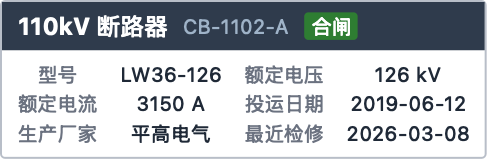
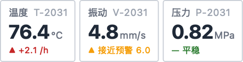
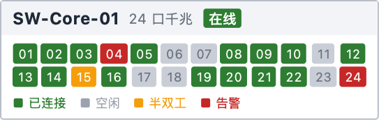
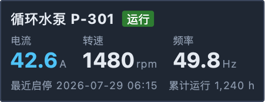

# BroadItem

**给已被锁定在 QGraphicsView 技术栈里的既有应用，提供数据驱动的场景内信息标牌。**

BroadItem 是一个 Qt5/Qt6 双栈的 C++ 静态库：从 XML 文件加载布局，渲染为 `QGraphicsItem`，支持数据绑定、条件分支（`<if>`）与循环（`<for>`）。布局 XML 可在现场调整，无需重新编译发版。

## 生态位边界

| 方案 | 为什么不是它 | BroadItem 的落点 |
|------|--------------|------------------|
| QML / QtQuick | scene graph 与 GraphicsView 互不嵌套，进不了存量场景 | 原生 `QGraphicsItem`，直接 `scene.addItem()` |
| HTML / WebEngine | 工业保守环境禁止引入 JS 引擎 | 纯 Qt 类型，零第三方依赖，全部源码可审计 |
| QGraphicsProxyWidget | 缩放失真、交互开销大 | 自绘 `paint()`，无嵌套 widget |
| 手写 `paint()` | 标牌变体 ≥5 种后边际成本线性增长 | XML 模板 + 数据绑定，变体零代码 |
| Qwt | 面向曲线/表盘等绘图部件，非场景内标牌 | 互补：进度条、表盘、曲线留给 Qwt |

设计护栏：无交互、无动画、无脚本；零第三方依赖；静态库可整体 vendor。完整规格见 `doc/设计.md`。

## 构建与安装

依赖：CMake ≥ 3.16，Qt5 或 Qt6（Core / Widgets / Xml）。

```bash
# Qt5（CMAKE_PREFIX_PATH 指向 Qt5 安装前缀）
cmake -B build -S . -DCMAKE_PREFIX_PATH=/path/to/qt5
cmake --build build

# Qt6：优先自动探测，亦可显式指定
cmake -B build-qt6 -S . -DCMAKE_PREFIX_PATH=/path/to/qt6
cmake --build build-qt6

# 安装（头文件 + 静态库 + CMake 包配置 + broaditem.xsd）
cmake --install build --prefix /your/prefix
```

下游经 CMake 消费：

```cmake
find_package(BroadItem CONFIG REQUIRED)
target_link_libraries(your_target PRIVATE BroadItem::BroadItem)
```

`find_package(BroadItem)` 会自动以**安装时构建所用的 Qt 主版本**执行 `find_dependency`——下游必须使用同一 Qt 主版本链接。也可不经安装，直接 `add_subdirectory(broaditem)`，同样提供 `BroadItem::BroadItem` 目标。

## 示例

以下标牌均为 BroadItem 实际渲染输出（布局文件在 `example/badges/`，为静态演示值）。运行 `./build/example/badges` 可在同一场景中集中查看，或用 `./build/example/frame_image <布局.xml> <输出.png>` 渲染单张。

实现手法上，这些标牌只用两类零件搭成：`column`/`row`/`grid` 容器与 `text` 叶子。外框是容器自带的盒模型装饰（1px 边框 + 2px 圆角 + 6–8px padding），尺寸完全由内容驱动，无需写死宽高；状态 chip 是「带背景色的小 `column` 包一个 `text`」（`text` 自身没有盒模型装饰，底色需由容器提供）；标签/值对齐和端口矩阵靠 `grid` 的规整行列实现；深色变体（泵组状态牌）只是同一套结构换了背景色与文字色。实际项目中把 `content`、`color`、`background-color` 等字面量换成 `b:` 绑定即接入数据，端口矩阵这类重复结构用 `<for>` 绑定列表生成。

### 电力资产铭牌（[breaker.xml](example/badges/breaker.xml)）

深色标题条 + 状态 chip + `grid` 参数对齐：



```xml
<?xml version="1.0" encoding="UTF-8"?>
<root xmlns:b="urn:broaditem:binding">
    <column background-color="#ffffff"
            border-width="1" border-style="solid" border-color="#b8bec8"
            border-radius="2" background-radius="2">
        <row background-color="#2f3b4c" padding="8" padding-top="5" padding-bottom="5"
             space="8" cross-align="center">
            <text font-size="12" bold="true" color="#ffffff">110kV 断路器</text>
            <text font-size="10" color="#9fb3c8">CB-1102-A</text>
            <column padding="4" padding-top="1" padding-bottom="1"
                    background-color="#2e7d32" background-radius="2">
                <text font-size="10" bold="true" color="#ffffff">合闸</text>
            </column>
        </row>
        <grid columns="4" rows="3" space-column="12" space-row="3"
              padding="8" padding-top="6" padding-bottom="6">
            <cell><text font-size="10" color="#6b7280">型号</text></cell>
            <cell><text font-size="10" color="#1f2937">LW36-126</text></cell>
            <cell><text font-size="10" color="#6b7280">额定电压</text></cell>
            <cell><text font-size="10" color="#1f2937">126 kV</text></cell>
            <cell><text font-size="10" color="#6b7280">额定电流</text></cell>
            <cell><text font-size="10" color="#1f2937">3150 A</text></cell>
            <cell><text font-size="10" color="#6b7280">投运日期</text></cell>
            <cell><text font-size="10" color="#1f2937">2019-06-12</text></cell>
            <cell><text font-size="10" color="#6b7280">生产厂家</text></cell>
            <cell><text font-size="10" color="#1f2937">平高电气</text></cell>
            <cell><text font-size="10" color="#6b7280">最近检修</text></cell>
            <cell><text font-size="10" color="#1f2937">2026-03-08</text></cell>
        </grid>
    </column>
</root>
```

### 遥测点组（[telemetry.xml](example/badges/telemetry.xml)）

大数字读数 + 单位 + 趋势行，三个块由外层 `row` 横向排列：



```xml
<?xml version="1.0" encoding="UTF-8"?>
<root xmlns:b="urn:broaditem:binding">
    <row space="4">
        <column background-color="#ffffff"
                border-width="1" border-style="solid" border-color="#c9ced6"
                border-radius="2" background-radius="2"
                padding="8" padding-top="6" padding-bottom="6" space="2">
            <row space="6">
                <text font-size="10" color="#6b7280">温度</text>
                <text font-size="10" color="#9ca3af">T-2031</text>
            </row>
            <row space="2" cross-align="end">
                <text font-size="20" bold="true" color="#1f2937">76.4</text>
                <text font-size="10" color="#6b7280" margin-bottom="2">°C</text>
            </row>
            <text font-size="9" color="#c62828">▲ +2.1 /h</text>
        </column>
        <column background-color="#ffffff"
                border-width="1" border-style="solid" border-color="#c9ced6"
                border-radius="2" background-radius="2"
                padding="8" padding-top="6" padding-bottom="6" space="2">
            <row space="6">
                <text font-size="10" color="#6b7280">振动</text>
                <text font-size="10" color="#9ca3af">V-2031</text>
            </row>
            <row space="2" cross-align="end">
                <text font-size="20" bold="true" color="#1f2937">4.8</text>
                <text font-size="10" color="#6b7280" margin-bottom="2">mm/s</text>
            </row>
            <text font-size="9" color="#f59e0b">▲ 接近预警 6.0</text>
        </column>
        <column background-color="#ffffff"
                border-width="1" border-style="solid" border-color="#c9ced6"
                border-radius="2" background-radius="2"
                padding="8" padding-top="6" padding-bottom="6" space="2">
            <row space="6">
                <text font-size="10" color="#6b7280">压力</text>
                <text font-size="10" color="#9ca3af">P-2031</text>
            </row>
            <row space="2" cross-align="end">
                <text font-size="20" bold="true" color="#1f2937">0.82</text>
                <text font-size="10" color="#6b7280" margin-bottom="2">MPa</text>
            </row>
            <text font-size="9" color="#2e7d32">— 平稳</text>
        </column>
    </row>
</root>
```

### 告警横幅（[alarm_banner.xml](example/badges/alarm_banner.xml)）

单行级别 chip + 时间 + 描述 + 确认状态：


```xml
<?xml version="1.0" encoding="UTF-8"?>
<root xmlns:b="urn:broaditem:binding">
    <column space="4">
        <row background-color="#fdf0ef"
             border-width="1" border-style="solid" border-color="#e3b8b3"
             border-radius="2" background-radius="2"
             padding="6" padding-top="4" padding-bottom="4" space="8" cross-align="center">
            <column padding="5" padding-top="1" padding-bottom="1"
                    background-color="#c62828" background-radius="2">
                <text font-size="10" bold="true" color="#ffffff">紧急</text>
            </column>
            <text font-size="11" color="#6b7280">14:32:07</text>
            <text font-size="11" color="#1f2937">2号主变油温 92°C 越上限</text>
            <text font-size="11" bold="true" color="#c62828">未确认</text>
        </row>
        <row background-color="#fdf8ec"
             border-width="1" border-style="solid" border-color="#e8d9ae"
             border-radius="2" background-radius="2"
             padding="6" padding-top="4" padding-bottom="4" space="8" cross-align="center">
            <column padding="5" padding-top="1" padding-bottom="1"
                    background-color="#f59e0b" background-radius="2">
                <text font-size="10" bold="true" color="#ffffff">预警</text>
            </column>
            <text font-size="11" color="#6b7280">14:28:51</text>
            <text font-size="11" color="#1f2937">1号主变负载率 86% 持续 10 min</text>
            <text font-size="11" color="#6b7280">已确认</text>
        </row>
    </column>
</root>
```

### 交换机端口面板（[switch_ports.xml](example/badges/switch_ports.xml)）

`grid` 12×2 端口矩阵，色块即状态（实际项目中端口由 `<for>` 绑定生成，此处为静态演示全部展开）：



```xml
<?xml version="1.0" encoding="UTF-8"?>
<root xmlns:b="urn:broaditem:binding">
    <column background-color="#ffffff"
            border-width="1" border-style="solid" border-color="#b8bec8"
            border-radius="2" background-radius="2">
        <row padding="8" padding-top="5" padding-bottom="5" space="8" cross-align="center"
             background-color="#f2f4f7">
            <text font-size="12" bold="true" color="#1f2937">SW-Core-01</text>
            <text font-size="10" color="#6b7280">24 口千兆</text>
            <column padding="4" padding-top="1" padding-bottom="1"
                    background-color="#2e7d32" background-radius="2">
                <text font-size="10" bold="true" color="#ffffff">在线</text>
            </column>
        </row>
        <grid columns="12" rows="2" space="2"
              padding="8" padding-top="6" padding-bottom="6">
            <cell><column padding="4" padding-top="2" padding-bottom="2" background-color="#2e7d32" background-radius="2"><text font-size="9" color="#ffffff">01</text></column></cell>
            <cell><column padding="4" padding-top="2" padding-bottom="2" background-color="#2e7d32" background-radius="2"><text font-size="9" color="#ffffff">02</text></column></cell>
            <cell><column padding="4" padding-top="2" padding-bottom="2" background-color="#2e7d32" background-radius="2"><text font-size="9" color="#ffffff">03</text></column></cell>
            <cell><column padding="4" padding-top="2" padding-bottom="2" background-color="#c62828" background-radius="2"><text font-size="9" color="#ffffff">04</text></column></cell>
            <cell><column padding="4" padding-top="2" padding-bottom="2" background-color="#2e7d32" background-radius="2"><text font-size="9" color="#ffffff">05</text></column></cell>
            <cell><column padding="4" padding-top="2" padding-bottom="2" background-color="#c9ced6" background-radius="2"><text font-size="9" color="#6b7280">06</text></column></cell>
            <cell><column padding="4" padding-top="2" padding-bottom="2" background-color="#c9ced6" background-radius="2"><text font-size="9" color="#6b7280">07</text></column></cell>
            <cell><column padding="4" padding-top="2" padding-bottom="2" background-color="#2e7d32" background-radius="2"><text font-size="9" color="#ffffff">08</text></column></cell>
            <cell><column padding="4" padding-top="2" padding-bottom="2" background-color="#2e7d32" background-radius="2"><text font-size="9" color="#ffffff">09</text></column></cell>
            <cell><column padding="4" padding-top="2" padding-bottom="2" background-color="#2e7d32" background-radius="2"><text font-size="9" color="#ffffff">10</text></column></cell>
            <cell><column padding="4" padding-top="2" padding-bottom="2" background-color="#c9ced6" background-radius="2"><text font-size="9" color="#6b7280">11</text></column></cell>
            <cell><column padding="4" padding-top="2" padding-bottom="2" background-color="#2e7d32" background-radius="2"><text font-size="9" color="#ffffff">12</text></column></cell>
            <cell><column padding="4" padding-top="2" padding-bottom="2" background-color="#2e7d32" background-radius="2"><text font-size="9" color="#ffffff">13</text></column></cell>
            <cell><column padding="4" padding-top="2" padding-bottom="2" background-color="#2e7d32" background-radius="2"><text font-size="9" color="#ffffff">14</text></column></cell>
            <cell><column padding="4" padding-top="2" padding-bottom="2" background-color="#f59e0b" background-radius="2"><text font-size="9" color="#ffffff">15</text></column></cell>
            <cell><column padding="4" padding-top="2" padding-bottom="2" background-color="#2e7d32" background-radius="2"><text font-size="9" color="#ffffff">16</text></column></cell>
            <cell><column padding="4" padding-top="2" padding-bottom="2" background-color="#c9ced6" background-radius="2"><text font-size="9" color="#6b7280">17</text></column></cell>
            <cell><column padding="4" padding-top="2" padding-bottom="2" background-color="#c9ced6" background-radius="2"><text font-size="9" color="#6b7280">18</text></column></cell>
            <cell><column padding="4" padding-top="2" padding-bottom="2" background-color="#2e7d32" background-radius="2"><text font-size="9" color="#ffffff">19</text></column></cell>
            <cell><column padding="4" padding-top="2" padding-bottom="2" background-color="#2e7d32" background-radius="2"><text font-size="9" color="#ffffff">20</text></column></cell>
            <cell><column padding="4" padding-top="2" padding-bottom="2" background-color="#2e7d32" background-radius="2"><text font-size="9" color="#ffffff">21</text></column></cell>
            <cell><column padding="4" padding-top="2" padding-bottom="2" background-color="#2e7d32" background-radius="2"><text font-size="9" color="#ffffff">22</text></column></cell>
            <cell><column padding="4" padding-top="2" padding-bottom="2" background-color="#c9ced6" background-radius="2"><text font-size="9" color="#6b7280">23</text></column></cell>
            <cell><column padding="4" padding-top="2" padding-bottom="2" background-color="#c62828" background-radius="2"><text font-size="9" color="#ffffff">24</text></column></cell>
        </grid>
        <row padding="8" padding-top="0" padding-bottom="6" space="10">
            <text font-size="9" color="#2e7d32">■ 已连接</text>
            <text font-size="9" color="#9ca3af">■ 空闲</text>
            <text font-size="9" color="#f59e0b">■ 半双工</text>
            <text font-size="9" color="#c62828">■ 告警</text>
        </row>
    </column>
</root>
```

### 泵组状态牌（[pump.xml](example/badges/pump.xml)）

深色面板变体，大数字工况读数 + 运行统计：



```xml
<?xml version="1.0" encoding="UTF-8"?>
<root xmlns:b="urn:broaditem:binding">
    <column background-color="#1f2733"
            border-width="1" border-style="solid" border-color="#39445a"
            border-radius="2" background-radius="2"
            padding="8" space="6">
        <row space="8" cross-align="center">
            <text font-size="12" bold="true" color="#e5eaf1">循环水泵 P-301</text>
            <column padding="4" padding-top="1" padding-bottom="1"
                    background-color="#2e7d32" background-radius="2">
                <text font-size="10" bold="true" color="#ffffff">运行</text>
            </column>
        </row>
        <row space="14">
            <column space="1">
                <text font-size="9" color="#8b98ab">电流</text>
                <row space="2" cross-align="end">
                    <text font-size="18" bold="true" color="#4fc3f7">42.6</text>
                    <text font-size="9" color="#8b98ab" margin-bottom="2">A</text>
                </row>
            </column>
            <column space="1">
                <text font-size="9" color="#8b98ab">转速</text>
                <row space="2" cross-align="end">
                    <text font-size="18" bold="true" color="#e5eaf1">1480</text>
                    <text font-size="9" color="#8b98ab" margin-bottom="2">rpm</text>
                </row>
            </column>
            <column space="1">
                <text font-size="9" color="#8b98ab">频率</text>
                <row space="2" cross-align="end">
                    <text font-size="18" bold="true" color="#e5eaf1">49.8</text>
                    <text font-size="9" color="#8b98ab" margin-bottom="2">Hz</text>
                </row>
            </column>
        </row>
        <row space="10">
            <text font-size="9" color="#8b98ab">最近启停 2026-07-29 06:15</text>
            <text font-size="9" color="#8b98ab">累计运行 1,240 h</text>
        </row>
    </column>
</root>
```

更多可运行示例见 `example/`（basic、status_panel、main_stretch 等）。

## 测试

```bash
ctest --test-dir build --output-on-failure      # Qt5
ctest --test-dir build-qt6 --output-on-failure  # Qt6
```

## 许可

MIT，见 `LICENSE`。布局 XML 的结构约束由 `broaditem.xsd` 描述（安装后位于 `share/broaditem/`）。
