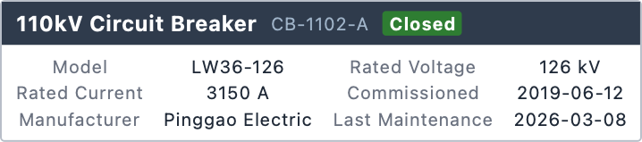
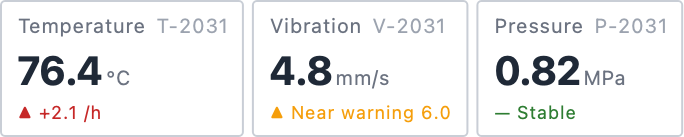
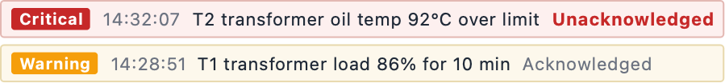
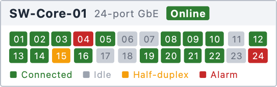
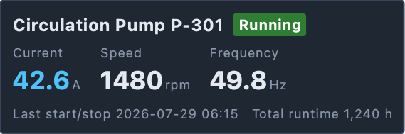

# BroadItem

[中文](../../README.md)

**Data-driven in-scene information badges for existing applications locked into the
QGraphicsView stack.**

BroadItem is a dual-stack (Qt5/Qt6) C++ static library: it loads layouts from XML files and renders
them as `QGraphicsItem`, with support for data binding, conditional branches (`<if>`), and loops
(`<for>`). Layout XML can be adjusted on site without recompiling or redeploying.

## Niche Boundaries

| Approach | Why not | Where BroadItem fits |
|----------|---------|----------------------|
| QML / QtQuick | scene graph and GraphicsView cannot be nested, so it cannot enter legacy scenes | native `QGraphicsItem`, straight into `scene.addItem()` |
| HTML / WebEngine | conservative industrial environments forbid embedding a JS engine | pure Qt types, zero third-party dependencies, fully auditable source |
| QGraphicsProxyWidget | scaling artifacts, high interaction overhead | self-rendered `paint()`, no nested widgets |
| Hand-written `paint()` | marginal cost grows linearly once badge variants reach 5+ | XML templates + data binding, variants with zero code |
| Qwt | oriented to plotting widgets like curves and dials, not in-scene badges | complementary: progress bars, dials, and curves stay with Qwt |

Design guardrails: no interaction, no animation, no scripting; zero third-party dependencies; static
library that can be vendored wholesale. Full specification in `doc/设计.md` (Chinese).

## Build and Install

Requirements: CMake ≥ 3.16, Qt5 or Qt6 (Core / Widgets / Xml).

```bash
# Qt5 (point CMAKE_PREFIX_PATH at the Qt5 installation prefix)
cmake -B build -S . -DCMAKE_PREFIX_PATH=/path/to/qt5
cmake --build build

# Qt6: auto-detected with priority, or set explicitly
cmake -B build-qt6 -S . -DCMAKE_PREFIX_PATH=/path/to/qt6
cmake --build build-qt6

# Install (headers + static library + CMake package config + broaditem.xsd)
cmake --install build --prefix /your/prefix
```

Consuming downstream via CMake:

```cmake
find_package(BroadItem CONFIG REQUIRED)
target_link_libraries(your_target PRIVATE BroadItem::BroadItem)
```

`find_package(BroadItem)` automatically runs `find_dependency` with **the Qt major version used at
build time** — downstream must link against the same Qt major version. You can also skip
installation and use `add_subdirectory(broaditem)` directly, which provides the same
`BroadItem::BroadItem` target.

## Examples

All badges below are actual BroadItem rendering output (layout files in `example/badges/en/`, with
static demo values). Run `./build/example/badges` to view the gallery together in one scene
(Chinese layouts), or use `./build/example/frame_image <layout.xml> <output.png>` to render a
single badge.

These badges are built from only two kinds of parts: `column`/`row`/`grid` containers and `text`
leaves. The outer frame is the container's built-in box-model decoration (1px border + 2px corner
radius + 6–8px padding), and sizes are entirely content-driven — no hard-coded width or
height; a
status chip is "a small `column` with a background color wrapping a `text`" (`text` itself has no
box-model decoration, so the background must come from a container); label/value alignment and the
port matrix rely on the regular rows and columns of `grid`; the dark variant (pump status panel) is
the same structure with different background and text colors. In real projects, replace literals
like `content`, `color`, and `background-color` with `b:` bindings to connect data, and generate
repeated structures like the port matrix with `<for>` bound to a list.

### Power Asset Nameplate ([breaker.xml](../../example/badges/en/breaker.xml))

Dark title bar + status chip + `grid` parameter alignment:



```xml
<?xml version="1.0" encoding="UTF-8"?>
<root xmlns:b="urn:broaditem:binding">
    <column background-color="#ffffff"
            border-width="1" border-style="solid" border-color="#b8bec8"
            border-radius="2" background-radius="2">
        <row background-color="#2f3b4c" padding="8" padding-top="5" padding-bottom="5"
             space="8" cross-align="center">
            <text font-size="12" bold="true" color="#ffffff">110kV Circuit Breaker</text>
            <text font-size="10" color="#9fb3c8">CB-1102-A</text>
            <column padding="4" padding-top="1" padding-bottom="1"
                    background-color="#2e7d32" background-radius="2">
                <text font-size="10" bold="true" color="#ffffff">Closed</text>
            </column>
        </row>
        <grid columns="4" rows="3" space-column="12" space-row="3"
              padding="8" padding-top="6" padding-bottom="6">
            <cell><text font-size="10" color="#6b7280">Model</text></cell>
            <cell><text font-size="10" color="#1f2937">LW36-126</text></cell>
            <cell><text font-size="10" color="#6b7280">Rated Voltage</text></cell>
            <cell><text font-size="10" color="#1f2937">126 kV</text></cell>
            <cell><text font-size="10" color="#6b7280">Rated Current</text></cell>
            <cell><text font-size="10" color="#1f2937">3150 A</text></cell>
            <cell><text font-size="10" color="#6b7280">Commissioned</text></cell>
            <cell><text font-size="10" color="#1f2937">2019-06-12</text></cell>
            <cell><text font-size="10" color="#6b7280">Manufacturer</text></cell>
            <cell><text font-size="10" color="#1f2937">Pinggao Electric</text></cell>
            <cell><text font-size="10" color="#6b7280">Last Maintenance</text></cell>
            <cell><text font-size="10" color="#1f2937">2026-03-08</text></cell>
        </grid>
    </column>
</root>
```

### Telemetry Group ([telemetry.xml](../../example/badges/en/telemetry.xml))

Big-number readings + units + trend lines, three blocks arranged horizontally by an outer `row`:



```xml
<?xml version="1.0" encoding="UTF-8"?>
<root xmlns:b="urn:broaditem:binding">
    <row space="4">
        <column background-color="#ffffff"
                border-width="1" border-style="solid" border-color="#c9ced6"
                border-radius="2" background-radius="2"
                padding="8" padding-top="6" padding-bottom="6" space="2">
            <row space="6">
                <text font-size="10" color="#6b7280">Temperature</text>
                <text font-size="10" color="#9ca3af">T-2031</text>
            </row>
            <row space="2" cross-align="baseline">
                <text font-size="20" bold="true" color="#1f2937">76.4</text>
                <text font-size="10" color="#6b7280">°C</text>
            </row>
            <text font-size="9" color="#c62828">▲ +2.1 /h</text>
        </column>
        <column background-color="#ffffff"
                border-width="1" border-style="solid" border-color="#c9ced6"
                border-radius="2" background-radius="2"
                padding="8" padding-top="6" padding-bottom="6" space="2">
            <row space="6">
                <text font-size="10" color="#6b7280">Vibration</text>
                <text font-size="10" color="#9ca3af">V-2031</text>
            </row>
            <row space="2" cross-align="baseline">
                <text font-size="20" bold="true" color="#1f2937">4.8</text>
                <text font-size="10" color="#6b7280">mm/s</text>
            </row>
            <text font-size="9" color="#f59e0b">▲ Near warning 6.0</text>
        </column>
        <column background-color="#ffffff"
                border-width="1" border-style="solid" border-color="#c9ced6"
                border-radius="2" background-radius="2"
                padding="8" padding-top="6" padding-bottom="6" space="2">
            <row space="6">
                <text font-size="10" color="#6b7280">Pressure</text>
                <text font-size="10" color="#9ca3af">P-2031</text>
            </row>
            <row space="2" cross-align="baseline">
                <text font-size="20" bold="true" color="#1f2937">0.82</text>
                <text font-size="10" color="#6b7280">MPa</text>
            </row>
            <text font-size="9" color="#2e7d32">— Stable</text>
        </column>
    </row>
</root>
```

### Alarm Banner ([alarm_banner.xml](../../example/badges/en/alarm_banner.xml))

Single-line severity chip + time + description + acknowledgement state:



```xml
<?xml version="1.0" encoding="UTF-8"?>
<root xmlns:b="urn:broaditem:binding">
    <column space="4">
        <row background-color="#fdf0ef"
             border-width="1" border-style="solid" border-color="#e3b8b3"
             border-radius="2" background-radius="2"
             padding="6" padding-top="4" padding-bottom="4" space="8" cross-align="center">
            <column padding="5" padding-top="1" padding-bottom="1"
                    background-color="#c62828" background-radius="2">
                <text font-size="10" bold="true" color="#ffffff">Critical</text>
            </column>
            <text font-size="11" color="#6b7280">14:32:07</text>
            <text font-size="11" color="#1f2937">T2 transformer oil temp 92°C over limit</text>
            <text font-size="11" bold="true" color="#c62828">Unacknowledged</text>
        </row>
        <row background-color="#fdf8ec"
             border-width="1" border-style="solid" border-color="#e8d9ae"
             border-radius="2" background-radius="2"
             padding="6" padding-top="4" padding-bottom="4" space="8" cross-align="center">
            <column padding="5" padding-top="1" padding-bottom="1"
                    background-color="#f59e0b" background-radius="2">
                <text font-size="10" bold="true" color="#ffffff">Warning</text>
            </column>
            <text font-size="11" color="#6b7280">14:28:51</text>
            <text font-size="11" color="#1f2937">T1 transformer load 86% for 10 min</text>
            <text font-size="11" color="#6b7280">Acknowledged</text>
        </row>
    </column>
</root>
```

### Switch Port Panel ([switch_ports.xml](../../example/badges/en/switch_ports.xml))

`grid` 12×2 port matrix, color as state (in real deployments ports are generated via `<for>`
binding; shown fully expanded here as a static demo):



```xml
<?xml version="1.0" encoding="UTF-8"?>
<root xmlns:b="urn:broaditem:binding">
    <column background-color="#ffffff"
            border-width="1" border-style="solid" border-color="#b8bec8"
            border-radius="2" background-radius="2">
        <row padding="8" padding-top="5" padding-bottom="5" space="8" cross-align="center"
             background-color="#f2f4f7">
            <text font-size="12" bold="true" color="#1f2937">SW-Core-01</text>
            <text font-size="10" color="#6b7280">24-port GbE</text>
            <column padding="4" padding-top="1" padding-bottom="1"
                    background-color="#2e7d32" background-radius="2">
                <text font-size="10" bold="true" color="#ffffff">Online</text>
            </column>
        </row>
        <grid columns="12" rows="2" space="2"
              padding="8" padding-top="6" padding-bottom="6">
            <cell><column padding="4" padding-top="2" padding-bottom="2" background-color="#2e7d32" background-radius="2"><text font-size="9" color="#ffffff">01</text></column></cell>
            <cell><column padding="4" padding-top="2" padding-bottom="2" background-color="#2e7d32" background-radius="2"><text font-size="9" color="#ffffff">02</text></column></cell>
            <cell><column padding="4" padding-top="2" padding-bottom="2" background-color="#2e7d32" background-radius="2"><text font-size="9" color="#ffffff">03</text></column></cell>
            <cell><column padding="4" padding-top="2" padding-bottom="2" background-color="#c62828" background-radius="2"><text font-size="9" color="#ffffff">04</text></column></cell>
            <cell><column padding="4" padding-top="2" padding-bottom="2" background-color="#2e7d32" background-radius="2"><text font-size="9" color="#ffffff">05</text></column></cell>
            <cell><column padding="4" padding-top="2" padding-bottom="2" background-color="#c9ced6" background-radius="2"><text font-size="9" color="#6b7280">06</text></column></cell>
            <cell><column padding="4" padding-top="2" padding-bottom="2" background-color="#c9ced6" background-radius="2"><text font-size="9" color="#6b7280">07</text></column></cell>
            <cell><column padding="4" padding-top="2" padding-bottom="2" background-color="#2e7d32" background-radius="2"><text font-size="9" color="#ffffff">08</text></column></cell>
            <cell><column padding="4" padding-top="2" padding-bottom="2" background-color="#2e7d32" background-radius="2"><text font-size="9" color="#ffffff">09</text></column></cell>
            <cell><column padding="4" padding-top="2" padding-bottom="2" background-color="#2e7d32" background-radius="2"><text font-size="9" color="#ffffff">10</text></column></cell>
            <cell><column padding="4" padding-top="2" padding-bottom="2" background-color="#c9ced6" background-radius="2"><text font-size="9" color="#6b7280">11</text></column></cell>
            <cell><column padding="4" padding-top="2" padding-bottom="2" background-color="#2e7d32" background-radius="2"><text font-size="9" color="#ffffff">12</text></column></cell>
            <cell><column padding="4" padding-top="2" padding-bottom="2" background-color="#2e7d32" background-radius="2"><text font-size="9" color="#ffffff">13</text></column></cell>
            <cell><column padding="4" padding-top="2" padding-bottom="2" background-color="#2e7d32" background-radius="2"><text font-size="9" color="#ffffff">14</text></column></cell>
            <cell><column padding="4" padding-top="2" padding-bottom="2" background-color="#f59e0b" background-radius="2"><text font-size="9" color="#ffffff">15</text></column></cell>
            <cell><column padding="4" padding-top="2" padding-bottom="2" background-color="#2e7d32" background-radius="2"><text font-size="9" color="#ffffff">16</text></column></cell>
            <cell><column padding="4" padding-top="2" padding-bottom="2" background-color="#c9ced6" background-radius="2"><text font-size="9" color="#6b7280">17</text></column></cell>
            <cell><column padding="4" padding-top="2" padding-bottom="2" background-color="#c9ced6" background-radius="2"><text font-size="9" color="#6b7280">18</text></column></cell>
            <cell><column padding="4" padding-top="2" padding-bottom="2" background-color="#2e7d32" background-radius="2"><text font-size="9" color="#ffffff">19</text></column></cell>
            <cell><column padding="4" padding-top="2" padding-bottom="2" background-color="#2e7d32" background-radius="2"><text font-size="9" color="#ffffff">20</text></column></cell>
            <cell><column padding="4" padding-top="2" padding-bottom="2" background-color="#2e7d32" background-radius="2"><text font-size="9" color="#ffffff">21</text></column></cell>
            <cell><column padding="4" padding-top="2" padding-bottom="2" background-color="#2e7d32" background-radius="2"><text font-size="9" color="#ffffff">22</text></column></cell>
            <cell><column padding="4" padding-top="2" padding-bottom="2" background-color="#c9ced6" background-radius="2"><text font-size="9" color="#6b7280">23</text></column></cell>
            <cell><column padding="4" padding-top="2" padding-bottom="2" background-color="#c62828" background-radius="2"><text font-size="9" color="#ffffff">24</text></column></cell>
        </grid>
        <row padding="8" padding-top="0" padding-bottom="6" space="10">
            <text font-size="9" color="#2e7d32">■ Connected</text>
            <text font-size="9" color="#9ca3af">■ Idle</text>
            <text font-size="9" color="#f59e0b">■ Half-duplex</text>
            <text font-size="9" color="#c62828">■ Alarm</text>
        </row>
    </column>
</root>
```

### Pump Status Panel ([pump.xml](../../example/badges/en/pump.xml))

Dark panel variant, big operating readings + runtime statistics:



```xml
<?xml version="1.0" encoding="UTF-8"?>
<root xmlns:b="urn:broaditem:binding">
    <column background-color="#1f2733"
            border-width="1" border-style="solid" border-color="#39445a"
            border-radius="2" background-radius="2"
            padding="8" space="6">
        <row space="8" cross-align="center">
            <text font-size="12" bold="true" color="#e5eaf1">Circulation Pump P-301</text>
            <column padding="4" padding-top="1" padding-bottom="1"
                    background-color="#2e7d32" background-radius="2">
                <text font-size="10" bold="true" color="#ffffff">Running</text>
            </column>
        </row>
        <row space="14">
            <column space="1">
                <text font-size="9" color="#8b98ab">Current</text>
                <row space="2" cross-align="baseline">
                    <text font-size="18" bold="true" color="#4fc3f7">42.6</text>
                    <text font-size="9" color="#8b98ab">A</text>
                </row>
            </column>
            <column space="1">
                <text font-size="9" color="#8b98ab">Speed</text>
                <row space="2" cross-align="baseline">
                    <text font-size="18" bold="true" color="#e5eaf1">1480</text>
                    <text font-size="9" color="#8b98ab">rpm</text>
                </row>
            </column>
            <column space="1">
                <text font-size="9" color="#8b98ab">Frequency</text>
                <row space="2" cross-align="baseline">
                    <text font-size="18" bold="true" color="#e5eaf1">49.8</text>
                    <text font-size="9" color="#8b98ab">Hz</text>
                </row>
            </column>
        </row>
        <row space="10">
            <text font-size="9" color="#8b98ab">Last start/stop 2026-07-29 06:15</text>
            <text font-size="9" color="#8b98ab">Total runtime 1,240 h</text>
        </row>
    </column>
</root>
```

More runnable examples in `example/` (basic, status_panel, main_stretch, etc.).

## Testing

```bash
ctest --test-dir build --output-on-failure      # Qt5
ctest --test-dir build-qt6 --output-on-failure  # Qt6
```

## License

MIT, see `LICENSE`. Structural constraints of layout XML are described by `broaditem.xsd`
(installed to `share/broaditem/`).
