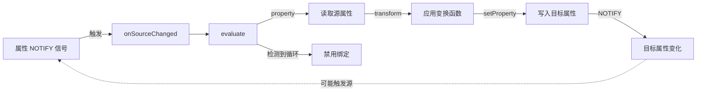
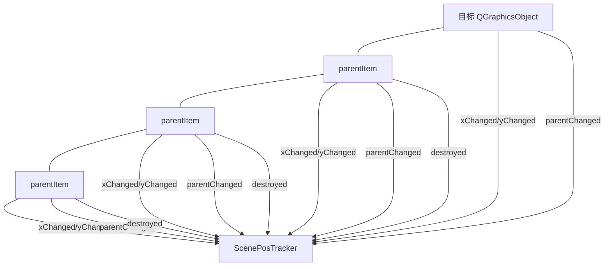
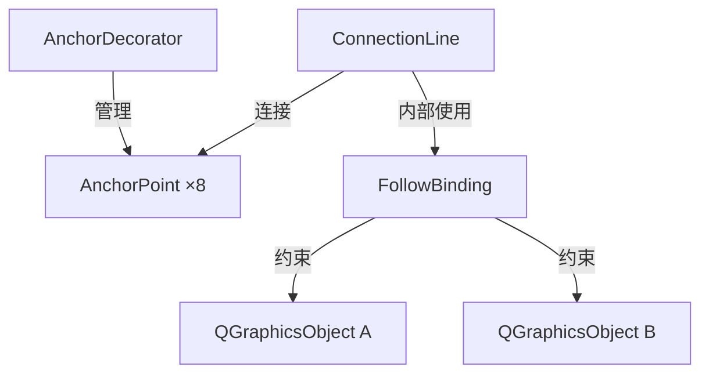

# BroadItem设计

## 概述

本文的主要内容是关于一种可以从xml文件加载布局的QGraphicsItem的设计；

## 目标

* 从文件加载；
* 支持一种布局系统，允许在不硬编码的情况下支持多种属性标牌；
* 简单的模版语言，支持简单的属性绑定和条件分支、循环；
* 预定义的若干部件；

## 布局系统

### 基础模型

本布局系统使用特化的box model来描述布局系统中各部分的大小和位置的计算逻辑，以下描述本模型的概念定义；

> 这个Item的布局系统的设计来源于这样的需求和事实：
>
> * 这个布局系统的核心目的是为了方便的定义静态（非交互式的）、样式独立于QStyle体系的标牌内容和样式，如果需要带有交互式控件、继承UI样式的Item更推荐ProxyWidget；
> * 由于Item往往浮动地位于View的某个位置，且Item的大小往往与View的大小无关，不受它的约束，甚至也不受屏幕大小的限制（一般来说希望Item至少小于屏幕大小，但这不是布局层次的约束），因此，常见的移动端和桌面端GUI框架的约束方式对它来说不适用，相比于它们，这个布局系统没有自上而下的约束；
> * 这个Item的首要目的是展示信息，所以那些直接控制内容绘制的元素，是尺寸真正的来源，它们根据绘制内容和策略决定自身的大小，并“撑开”外围的布局；

#### 部件

部件是模型中的最小单元，一个部件在xml文档中对应一个节点；

#### 属性

属性是指部件具有的属性，表现为xml文档中节点的一个属性；

#### 盒模型

所有可渲染部件（非控制部件）都隐式地持有盒模型属性：margin、border、background、padding。由外到内依次为：

##### margin-box

margin-box位于容器的最外层，是整个容器的边界，margin定义了容器的外边距，可以单独定义某一个方向的外边距大小；

##### border-box

border-box 位于 margin-box 内，border 定义了容器的边框和边框样式，四个角的圆角大小必须一致，四边的边框宽度必须一致；

> border 的圆角大小与 background 的圆角大小允许不一致，background 的圆角可以独立设置；

##### padding-box

padding-box位于border-box内，padding定义了容器的内边距，可以单独定义某一个方向的内边距大小；

##### content

content是容器中被padding-box包裹的的部分，可能是一个部件，也可以是另一个容器；

##### background

background定义了容器的背景颜色，background的大小与border-box等大；

#### 容器

容器即可渲染部件，它对应 box model 中的 box 定义，由外而内包括：margin、border、background、padding、content；

任意的可渲染部件本身就是一个容器，因为它隐式地带有完整的盒模型属性；

##### 容器的大小

容器的大小由盒模型属性和内容共同决定：padding-top + padding-bottom + margin-top + margin-bottom + content 高度 + border-width×2；宽度为 padding-left + padding-right + margin-left + margin-right + content 宽度 + border-width×2；

##### 容器的扩展

当容器被拉伸时，只有 content 的大小会被拉伸；

#### 盒模型属性

盒模型属性是可渲染部件（非控制部件）的内置属性，可直接写在 XML 元素上：

| 属性名 | 含义 | 默认值 |
|--------|------|--------|
| `margin` | 四边外边距（简写） | 0 |
| `margin-left`/`right`/`top`/`bottom` | 单边外边距 | 0 |
| `padding` | 四边内边距（简写） | 0 |
| `padding-left`/`right`/`top`/`bottom` | 单边内边距 | 0 |
| `border-width` | 边框宽度 | 0 |
| `border-color` | 边框颜色 | #000000 |
| `border-radius` | 边框圆角半径 | 0 |
| `border-style` | 边框线型（`solid`/`none`） | `none` |
| `background-color` | 背景色 | #FFFFFF |
| `background-radius` | 背景圆角半径 | 0 |
| `background-opacity` | 背景不透明度 | 1 |

> 设置 `background-color`、`background-radius` 或 `background-opacity` 中任一属性会隐式启用背景绘制。

> 所有可渲染部件默认不显示边框和背景（`border-style="none"`、`background-color` 未设置）。

### 计算模型

#### 两段决议

容器绘制计算由两段决议构成：

1. **测量（Measure）**：自底向上计算每个容器的期望尺寸（intrinsic size）。叶子节点（如 `<text>`）根据自身内容与装饰器计算；容器节点根据子部件的尺寸与排列规则计算。
2. **布局（Layout）**：自上而下分配最终尺寸。父容器根据可用空间与对齐属性，将剩余空间分配给子部件，并确定每个容器的最终位置。

> 自计算部件支持通过 `width`、`height` 属性指定请求尺寸，布局可以拉伸或压缩子元素。如果指定尺寸小于内容，内容将被裁剪。

布局的最终大小决定这个 Item 的 boundingRect 大小；

> 计算模型支持指定自计算部件的大小，但不支持指定容器的大小，这是刻意设计的，因为GraphicsItem浮动地位于GraphicsScene中的某个位置，往往大小不一、且不会占据整个父窗口或屏幕，因此，Item对于稳定的总大小没有像窗口那样稳定的要求，所以在考虑Item的布局计算时，将自计算部件（文本，将来还可能扩展其他形式，如图片）稳定的展示效果放在了更重要的位置，这要求布局系统可以提供更具有针对性的语义来表达期望的显示效果对大小的要求：
>
> * 用户可以指定大小：
>
>   * 当内容完整绘制所需的大小小于指定的大小时，部件的对齐方式生效，将内容绘制在部件区域的适当位置；
>   * 当内容完整绘制所需的大小大于指定的大小时，裁切策略生效，这决定了部件如何不完整地显示；
>
>   在这种情况下，不允许容器拉伸部件，这确保元素以用户期望的方式绘制，但同时也导致了部件本身的位置是不明确的，例如，在`row`中，部件的高度可能小于`row`的高度，但是容器不知道部件应该与`row`的顶部、中线还是底部对齐，这种情况是需要进一步明确的；
>
> * 用户不指定大小时，大小是自动的，所以自绘制元素的大小取决于：
>
>   * 内容的绘制大小；
>   * 容器是否需要拉伸部件；

#### 运行时展平（Flatten）

控制部件（`<for>`、`<if>`）在解析阶段以模板层树节点形式存在，但在**物化阶段**被**透明地展开**为实例层节点序列，直接参与父容器的统一布局。这一过程称为**运行时展平**。

父容器在物化子元素时，对每个子模板调用 `materializeChildren(ctx)`，将控制元素结构性展开为 0..N 个实例节点：

- `<for>` 根据绑定的列表数据，为每个迭代项创建项级 `MapPropertyContext`（通过 `b:as` 变量名绑定当前值），链接到全局上下文后对模板执行 `materialize()`，生成多个独立实例节点。
- `<if>` 根据条件判断结果，物化出子元素的节点序列或返回空序列。
- 普通元素物化为单个节点。

展平后的实例节点序列作为父容器的**直接子节点**参与后续的 `measure`/`layout`/`render`。这意味着控制元素自身不产生节点、不拥有独立的布局边界，其展开后的实例完全由父容器统一管理 spacing、alignment、stretch 等行为。单内容容器（如 `<cell>`）的内容物化出多个节点时，按垂直堆叠布局。

### xml文档

一种BroadItem布局由一个xml文件给出，以下说明xml文档的规格；

#### 根节点

* xml 必须以根节点 \<root> 开始；
* root 的直接子节点只有一个；
* root 节点暂不支持任何属性；

若不满足要求，使解析失败并输出错误日志；

#### 加载xml文档

BroadItem类有两种加载xml文件的方法：

* 在类构造函数传入xml文件路径；
* 提供一个全局函数和注册中心，该函数接收一个路径作为参数，一次性加载该路径下的所有xml文件，在注册中心中为其指定一个唯一id，稍后可以将这个id传递给类的构造函数以使用该布局创建BroadItem；

如果一个xml文件的解析出现错误，应跳过它解析下一个文件；

#### 诊断

考虑到xml文档可能存在的不满足定义的情况，xml的加载解析器需要对xml文档进行诊断：

* 若节点中存在不属于它的属性，跳过该属性并输出警告日志；
* 若一个不应存在子部件的部件定义了子部件，使解析失败，输出错误日志；
* 如果节点的属性的值不是属性指定的类型，则跳过该属性并输出错误日志；

#### 实现建议

为了实现文件解析、渲染、绑定，强烈建议为每一个部件实现单独的类；

> **注意：控制元素自身的伪属性陷阱**
>
> 伪属性检测（`hasAttributeNS(BINDING_NS, "of")` / `hasAttributeNS(BINDING_NS, "prop")`）对 **所有元素**生效，
> 包括 `<for>` 和 `<if>` 自身。如果不加防护，`<for b:of="list">` 会被**双重包装**：
>
> 1. 先作为 `<for>` 元素正常解析 → 创建 ForElement A（含 `step` 等属性）
> 2. 伪属性检测命中 `b:of` → 再套一层 ForElement B（默认值），A 沦为 B 的 `m_template`
>
> 物化时 `materializeChildren()` 调用的是外层 B（丢失了内层的 `step` 等配置），
> 导致循环行为异常（如始终以 `step=1` 展开）。
>
> **优雅解法**：将伪属性检测**前置**到 `createElement` 之前，
> 对非控制标签（`tag != "for" && tag != "if"`）才执行包装：
>
> ```cpp
> // Pseudo-attribute wrappers: for non-control elements, b:of and b:prop
> // create implicit <for>/<if> wrappers.  Control elements themselves
> // are exempt: <for b:of="list"> is a real for-element, not a wrapper.
> if (tag != "for" && tag != "if") {
>     if (xml.hasAttributeNS(BINDING_NS, "of")) {
>         auto wrapper = std::make_shared<ForElement>();
>         wrapper->setBindProperty(xml.attributeNS(BINDING_NS, "of", QString()));
>         if (xml.hasAttributeNS(BINDING_NS, "as"))
>             wrapper->setAsVariable(xml.attributeNS(BINDING_NS, "as", QString()));
>         auto inner = parseNode(xml);
>         if (inner)
>             wrapper->setTemplate(inner);
>         return wrapper;
>     }
>     if (xml.hasAttributeNS(BINDING_NS, "prop")) {
>         auto wrapper = std::make_shared<IfElement>();
>         wrapper->setBindProperty(xml.attributeNS(BINDING_NS, "prop", QString()));
>         auto inner = parseNode(xml);
>         if (inner)
>             wrapper->setChild(inner);
>         return wrapper;
>     }
> }
> ```
>
> 检测前置后尾部不再有包装逻辑，从结构上杜绝了双重包装的可能。

#### 绑定属性的命名空间声明

BroadItem 的绑定属性使用 W3C XML Namespaces 规范声明。在 XML 布局文件的根元素上必须声明绑定命名空间：

```xml
<root xmlns:b="urn:broaditem:binding">
  ...
</root>
```

命名空间 URI 为 `urn:broaditem:binding`。本文档示例使用 `b:` 作为规范前缀，但解析器通过 URI 匹配属性（`hasAttributeNS`），任何绑定到 `urn:broaditem:binding` 的前缀均被接受。例如，以下两种写法等价：

```xml
<!-- 使用 b: 前缀 -->
<root xmlns:b="urn:broaditem:binding">
  <text b:content="title">默认文本</text>
</root>

<!-- 使用 bind: 前缀 -->
<root xmlns:bind="urn:broaditem:binding">
  <text bind:content="title">默认文本</text>
</root>
```

> **历史说明**：旧版 BroadItem 曾使用 `:xxx` 冒号前缀（如 `:content`），该语法不符合 W3C XML Namespaces 规范（Prefix 不能为空），已于命名空间重构中移除。

### 数据绑定

所有 XML 属性默认均为**字面量语义**。**任意字面量属性均可写为 `b:attr` 形式**（命名空间前缀绑定属性），将属性声明为**引用语义**，值将到 `PropertyContext` 中查找。例如 `b:content="title"`、`b:color="accentColor"`。

第一批支持绑定的属性清单：

| 类别 | 可绑定属性 |
|------|-----------|
| 盒模型（17 个） | `margin` `margin-left` `margin-right` `margin-top` `margin-bottom` `padding` `padding-left` `padding-right` `padding-top` `padding-bottom` `border-radius` `border-style` `border-width` `border-color` `background-color` `background-radius` `background-opacity` |
| 尺寸 | `width` `height` |
| 文本样式（`<text>`） | `color` `font-size` `bold` `under-line` `font-family` |

保留属性 `of`/`prop`/`as`/`content`/`not` 走控制元素与文本内容的专用通道（`<for>`/`<if>` 伪属性包装、`TextElement` 内容绑定；`not` 是 `<if>` 的结构性修饰符，永不参与绑定），不进入通用绑定表。

> 布局属性（`space`/`main-align`/`cross-align`/`columns`/`rows` 等）与 `<text>` 的 `v-align`/`h-align`/`wrap`/`max-width` 将在后续批次开放绑定。

绑定属性若在元素的 `supportedAttributes` 内但暂无求值路径，`parseBindings` 会输出「已注册未解析」的 `qWarning`（"registered but not resolved"），但绑定仍照常注册（向前兼容，求值路径由各元素覆写 `resolvedAttributes()` 声明，后续批次补齐）。

动态属性值的类型限制为 `QString`、`QStringList`、`QVariantMap` 和 `QVariantList`，其中 `QVariantMap` 和 `QVariantList` 用于路径遍历的中间节点。

##### 类型契约

每个属性消费者（绑定路径）对 `QVariant::type` 有精确要求：

| 绑定 / 路径操作 | 消费方 | 要求 `QVariant::type` | 不匹配行为 |
|----------------|--------|----------------------|-----------|
| `b:content` | `TextElement` | 无要求（统一 `toString()` 转换） | 回退到标签内默认文本 |
| `b:of` | `ForElement` | `QVariant::StringList` 或 `QVariant::List` | `qCritical`，返回空列表（无循环输出） |
| `b:as` | `ForElement` | `QVariant::String`（变量名） | 强制属性，缺失时 `qCritical` 并返回空列表 |
| `b:prop` | `IfElement` | 无要求（equals 比较时统一 `toString()` 转换） | 仅检查存在性与非 null；比较语义见 `<if>` 章节 |
| `b:equals` | `IfElement` | 无要求（统一 `toString()` 转换） | 路径不可解析时该次求值条件不成立 |
| `.key` 段 | 路径引擎 `walkNested` | `QVariant::Map` | `qCritical`，路径解析终止 |
| `[n]` 索引 | 路径引擎 `advanceBrackets` | `QVariant::List` | `qCritical`，路径解析终止 |
| 通用绑定（数值） | `resolveDouble` | 可经 `QVariant::toString()` 转换为合法 `double` | `qCritical`，回退该属性默认值 |
| 通用绑定（颜色） | `resolveColor` | `QVariant::String` 且 `QColor::isValid()` | `qCritical`，回退该属性默认值 |
| 通用绑定（布尔） | `resolveBool` | `QVariant::Bool`，或字符串 `"true"`/`"false"`/`"1"`/`"0"` | `qCritical`，回退该属性默认值 |
| 通用绑定（字符串） | `resolveString` | `QVariant::String` | `qCritical`，回退该属性默认值 |

通用绑定的失配回退行为分两级：**绑定路径不存在**（`hasProperty` 未命中）时静默回退该属性默认值，不输出日志（属性尚未注入上下文属正常状态）；**类型不匹配**时输出 `qCritical` 并回退该属性默认值。数值经字符串转换验证，颜色要求 `QString` 型且 `QColor` 有效，布尔接受 `Bool` 型或 `"true"/"false"/"1"/"0"` 字符串，字符串要求 `QString` 型。

> `MapPropertyContext` 在平铺写入端（不含 `.` 或 `[` 的键）不做类型校验；嵌套写入沿路径每步执行类型检查。类型安全由消费方在读取时自行验证。

动态属性的存储和管理由 `PropertyContext` 抽象（见下方「动态属性模型」节）。

##### 物化时求值（ResolvedStyle 快照）

绑定属性在每次**物化**时按当前 `PropertyContext` 求值，结果写入实例层节点，模板层 `Element` 保持不可变：

| 求值入口 | 求值属性 | 写入位置 |
|---------|---------|---------|
| `RenderableElement::resolveStyle(ctx, out)` | 盒模型 17 属性 | `Node::style`（`ResolvedStyle`） |
| `SizedElement::resolveSize(ctx, out)` | `width` `height` | `Node::style` |
| `TextElement::materialize` | `color` `font-size` `bold` `under-line` `font-family` | `TextNode` 文本样式字段 |

measure/layout/render 三阶段只读快照，物化完成后快照不可变。属性变更的传播链：`setDynamicProperty` → `bindsProperty` 命中（前缀匹配 + 通用绑定表遍历）→ 重新物化 → 快照更新 → 重绘。未命中任何绑定的属性变更不触发重布局。

##### item context（`<for>` 循环中的项级上下文）

在 `<for>` 循环中，每个迭代项创建独立的 `MapPropertyContext` 作为**项级上下文**，并通过 `ItemPropertyContext` 链接到全局 `PropertyContext`。绑定属性解析的查找优先级：

1. **项级上下文** — 当前迭代项的数据（`b:as` 变量名对应的值）。支持嵌套路径：若迭代值为 `QVariantMap`，其字段以平铺键写入项级上下文，可直接通过 `字段名` 或 `变量名.字段名` 访问
2. **全局上下文** — 若项级上下文中未找到，回退到父容器的全局 `PropertyContext`

例如，`<for b:of="users" b:as="user">` 中绑定 `b:content="user.name"`：
- `user.name` → `ItemPropertyContext` 剥离 `user.` 前缀 → 在项级上下文查找 `name` → 命中返回
- `global_title` → 项级上下文未找到 → 回退到全局上下文查找

嵌套属性路径如 `user.address.city`，在 `address` 为 `QVariantMap` 时通过路径引擎 `walkNested` 正常遍历。

若路径解析失败（类型不匹配、键不存在、路径语法错误等），输出 `qWarning` 并返回空字符串。`b:as` 变量名本身不是全局属性（`bindsProperty` 会剥离 `b:as` 前缀），修改全局同名字段不会触发 per-item 重绘。

#### 绑定语法规则

| 写法 | 语义 | 说明 |
|------|------|------|
| `content="hello"` | **字面量** | 文本内容就是 "hello" |
| `b:content="title"` | **引用** | 去 `PropertyContext` 查找 `title` 属性的值 |
| `color="#333"` | **字面量** | 颜色就是 `#333` |
| `b:color="accent"` | **引用** | 去 `PropertyContext` 查找 `accent` 属性的值 |

以上规则对全部可绑定属性一致：

- 同一属性不能同时存在字面量和引用形式（如 `color="#333"` 和 `b:color="accent"` 同时出现），解析时输出 `qCritical` 并**忽略绑定**（字面量生效）。
- 通用绑定属性在 `PropertyContext` 中不存在时，静默回退该属性默认值；类型不匹配时输出 `qCritical` 并回退默认值（详见上方「类型契约」）。
- `b:content` 例外（专用通道，行为与通用绑定不同）：属性不存在或路径解析失败时回退到**标签内默认文本**（路径引擎对畸形路径输出 `qWarning`）；绑定值统一经 `QVariant::toString()` 转换，不做类型检查（旧版的 `qCritical` 类型检查已随双模式删除移除）。

### 动态属性模型

#### 概述

`PropertyContext` 将动态属性的存储与变更通知从 `BroadItem` 中分离为独立的抽象，允许通过不同策略管理属性数据，同时支持多个 `BroadItem` 通过 `shared_ptr` 共享同一份数据源。变更通知通过回调函数（`std::function`）传递，不使用信号槽，因为属性修改仅在主线程发生。

#### PropertyContext 抽象基类

`PropertyContext` 定义了所有策略必须实现的最小接口：

| 方法 | 说明 |
|------|------|
| `property(name)` | 读取属性值，支持扁平键和嵌套路径 |
| `hasProperty(name)` | 判断属性是否存在 |
| `setProperty(name, value)` | 设置属性值，支持扁平键和嵌套路径，触发变更通知 |
| `operator[](key)` | 返回 PropertyProxy，支持方括号链式访问语法 |

##### 路径引擎

基类提供三个 `protected static` 方法作为统一的路径遍历引擎，所有三种策略复用同一实现，确保路径语义一致：

| 方法 | 职责 |
|------|------|
| `advanceBrackets(current, path, pos)` | 消化路径中的 `[n]` 数组索引，修改 current 并返回新位置 |
| `walkNested(current, path, pos)` | 纯嵌套遍历：从已解析的首段值出发，递进处理 `.key` 和 `[n]`，每步执行类型检查与 `qCritical` 错误记录 |
| `walkPathFromObject(obj, path)` | QObject 首段查找：解析首段 key，通过 `QObject::property()` 获取值，消化 `[n]` 后对接 `walkNested` |
| `setWalkInto(current, path, pos, value)` | 嵌套写入辅助：沿 path[pos:] 遍历 `current` 的嵌套结构，在叶子位置设置 value。每步执行类型校验，失败返回 false 且不修改 current（无副作用）。由 `setProperty` 的嵌套路径分支调用 |

策略调用关系：

```
MapPropertyContext  → m_map 查找首段 → advanceBrackets → walkNested
                    → 嵌套 set        → setWalkInto

QPropertyContext    → QObject::property() 查找首段 → walkPathFromObject
                    → 嵌套 set                    → setWalkInto
  (自宿主模式: target = this)
  (代理模式:  target = item 等 QObject*)
```

##### 路径语法与类型检查

`property(name)` 和 `hasProperty(name)` 同时支持扁平键和嵌套路径。当 `name` 包含 `.` 或 `[` 时自动进入路径遍历模式，否则按扁平键查找。

| 路径 | 含义 |
|------|------|
| `cpu` | 扁平键 |
| `device.cpu` | 对象遍历 |
| `processes[0]` | 数组索引 |
| `processes[0].name` | 数组元素为对象，取字段 |
| `a[0][1]` | 多维数组 |

语法规则：段间以 `.` 分隔，段名不可为空；数组索引必须为 `[非负整数]`，方括号必须配对；段结束后的下一个字符必须是 `.` 或到达路径末尾，否则为语法错误。

路径遍历每步执行类型断言：

| 操作 | 类型要求 | 失败行为 |
|------|---------|---------|
| `.key` | 当前必须是 `QVariantMap` | `qCritical` + 返回 `QVariant()` |
| `[n]` | 当前必须是 `QVariantList` | `qCritical` + 返回 `QVariant()` |
| `[n]` 越界 | `0 ≤ n < list.size()` | `qCritical` + 返回 `QVariant()` |
| key 不存在 | map 中无此键 | `qCritical` + 返回 `QVariant()` |
| 语法错误 | 符合语法规则 | `qCritical` + 返回 `QVariant()` |

以上 `qCritical` 错误记录仅针对路径遍历期间的错误（定位到具体路径和步骤）。扁平 key 不存在时不记录日志——属性未设置属于正常状态。

##### 嵌套写入

`setProperty(name, value)` 当 `name` 包含 `.` 或 `[` 时进入嵌套写入模式：提取首段 key → 从存储中取出对应值 → 沿路径遍历到父容器 → 在叶子位置设置 value → 写回存储 → 以首段 key 触发 `notifyChanged`。

与路径读取不同，嵌套写入要求路径的**每一段前缀必须存在且类型正确**，不会自动创建中间对象：

| 操作 | 类型要求 | 失败行为 |
|------|---------|---------|
| 子路径 `.key` | 当前必须是 `QVariantMap` | `qCritical` + 不写入 |
| 子路径 `[n]` | 当前必须是 `QVariantList` | `qCritical` + 不写入 |
| 子路径 `[n]` 越界 | `0 ≤ n < list.size()` | `qCritical` + 不写入 |
| 子路径 key 不存在 | map 中无此键 | `qCritical` + 不写入 |
| 首段 key 不存在 | 存储中无此 key | `qCritical` + 不写入 |

所有错误在检测到后立即终止，不产生任何副作用（中途复制的数据被丢弃）。

**通知语义**：写入成功后以**首段 key**（而非完整路径）调用 `notifyChanged`。例如 `setProperty("device.cpu", "45%")` 触发 `notifyChanged("device", ...)`。由于 `bindsProperty` 使用前缀匹配（`bindPath.startsWith(propName + ".")`），所有绑定到 `device.cpu`、`device.mem` 等子路径的元素都会收到重绘通知。

嵌套写入复用基类的 `walkNested` / `advanceBrackets` 路径解析规则，新增 `setWalkInto`（`protected static`）执行遍历与修改。

##### PropertyProxy 语法糖

`PropertyContext` 和 `BroadItem` 均支持 `operator[](const QString&)` 和 `operator[](int)`，返回 `PropertyProxy` 代理对象，提供方括号链式访问语法：

    QVariant v = item["device"]["cpu"];    // 等价于 item.dynamicProperty("device.cpu")
    item["items"][0]["name"] = "nginx";     // 等价于 item.setDynamicProperty("items[0].name", "nginx")

代理对象按每次方括号调用拼接路径字符串（`.` 分隔键名、`[n]` 表示下标），最终通过隐式 `operator QVariant()` 执行读取，或通过 `operator=` 执行写入。

| 操作 | 等效调用 |
|------|---------|
| `ctx["a"]` | `ctx.property("a")` |
| `ctx["a"]["b"]` | `ctx.property("a.b")` |
| `ctx["items"][0]` | `ctx.property("items[0]")` |
| `ctx["a"] = v` | `ctx.setProperty("a", v)` |
| `ctx["a"]["b"] = v` | `ctx.setProperty("a.b", v)`（嵌套写入） |

`BroadItem::operator[]` 内部委托给持有的 `PropertyContext` 的同名重载，实现路径一致。

语法错误（如 `".a"`、`"a..b"`、`"a."`、`"items[0"`、`"items[-1]"`、`"items[abc]"`、`"items[0]x"`）在路径解析阶段被路径引擎发现，打印 `qCritical` 并返回无效 `QVariant` / 跳过写入。

#### 两种策略

##### 策略一：MapPropertyContext（默认）

内部持有 `QVariantMap` 存储属性数据，通过基类共享引擎 `walkNested` 实现路径遍历。`setProperty` 支持嵌套路径写入：当 `name` 包含 `.` 或 `[` 时自动进入嵌套写入模式，语义见「嵌套写入」节。

若构造 `BroadItem` 时未显式传入 `PropertyContext`，则自动创建 `MapPropertyContext` 作为默认实现。

**通知机制**：在 `setProperty()` 内手动调用 `notifyChanged()`，不依赖 QObject 属性系统。

**空值语义**：`setProperty(name, QVariant())` 表示移除属性——该键从 `QVariantMap` 中删除，`hasProperty(name)` 返回 `false`。这使 `<if b:prop="warning">` 的条件隐藏自然运作：设置空值即可隐藏内容。

**变更检测**：新旧值相同时跳过通知。

##### 策略二：QPropertyContext（自宿主 / 代理双模式）

自身不存储数据，继承 `QObject` 并通过 `Q_PROPERTY` 声明属性，支持双模式：

- **自宿主模式**（`QPropertyContext()`）：监视自身声明的 Q_PROPERTY，通过 `event()` 拦截动态属性
- **代理模式**（`QPropertyContext(target, parent)`）：监视目标对象的 Q_PROPERTY，通过 `eventFilter` 拦截动态属性

读取时通过 `QObject::property()` 获取，设置时调用 `QObject::setProperty()`。路径遍历通过 `walkPathFromObject` 实现。`setProperty` 支持嵌套路径写入（语义与 `MapPropertyContext` 一致，见「嵌套写入」节）。

**通知机制**：构造后通过 `QTimer::singleShot(0)` 延迟遍历目标对象的 `metaObject()` 中所有带 NOTIFY 信号的 Q_PROPERTY，通过 `QMetaObject::connect` 自动连接到内部槽 `onNotify()`（延迟确保派生类 Q_PROPERTY 已就绪）。`setProperty()`、`property()`、`hasProperty()` 内同步调用 `ensureConnected()` 作为兜底（幂等），确保在无事件循环环境中首次调用时立即建立连接。动态属性通过 `event()`（自宿主）或 `eventFilter()`（代理）拦截 `QDynamicPropertyChangeEvent` 处理。

用户只需在 Q_PROPERTY 中定义 NOTIFY 信号并在 setter 中 emit，无需手动调用 `notifyChanged()`：

```cpp
class MyContext : public BroadItem::QPropertyContext {
    Q_OBJECT
    Q_PROPERTY(QString cpu READ cpu WRITE setCpu NOTIFY cpuChanged)
signals:
    void cpuChanged();
public:
    QString cpu() const { return m_cpu; }
    void setCpu(const QString& v) {
        if (m_cpu != v) { m_cpu = v; emit cpuChanged(); }
    }
private:
    QString m_cpu;
};
```

Q_PROPERTY 可声明为任意 Qt 元类型。若要支持路径访问，将属性声明为 `QVariantMap` 或 `QVariantList` 并定义 NOTIFY 即可：

```cpp
Q_PROPERTY(QVariantMap device READ device WRITE setDevice NOTIFY deviceChanged)
```

> **注意**：Q_PROPERTY 是编译期声明的，始终存在（`hasProperty` 对已声明属性恒为 `true`）。`hasProperty` 对运行时动态属性同样返回 `true`。`null` 值（如 `QString()` 的默认值）在 `<if>` 中被视为不存在——`QString()` 默认值的属性不会触发条件显示。若需要区分"显式设 null"和"未初始化"，使用 `MapPropertyContext`。

**限制**：Q_PROPERTY 的 WRITE setter 必须 emit NOTIFY 信号，否则变更不会被拦截。

#### BroadItem 集成

##### 接口变更

- 基类改为 `QGraphicsObject`（Qt5/Qt6 兼容，为 Q_PROPERTY 代理模式提供基础）
- 构造函数接受可选的 `std::shared_ptr<PropertyContext>`，`nullptr` 时自动创建 `MapPropertyContext`
- 新增 `setPropertyContext(std::shared_ptr<PropertyContext>)`
- 原有 `setDynamicProperty()` / `dynamicProperty()` / `hasDynamicProperty()` 保留为便捷转发

##### 变更通知与重绘

`BroadItem` 在 `setPropertyContext()` 时向 `PropertyContext` 注册回调。回调中检查 `bindsProperty(name)`，确认有元素绑定该属性后触发 `updateLayout()` + `update()` 完成重新测量、布局和绘制。回调执行是同步的（主线程直接调用），暂不做合并优化。

`PropertyContext` 通过 `shared_ptr` 被多个 `BroadItem` 共享时，一个属性变更将同时触发所有关联 item 的重绘。

##### bindsProperty 前缀匹配

为避免设置父级对象时错过重绘通知，`Element::matchesProperty()` 支持路径前缀匹配：

- `b:of="device.cpu"` 的元素会被 `bindsProperty("device")` 命中（前缀匹配 `device.`）
- `b:of="processes[0].name"` 的元素会被 `bindsProperty("processes")` 命中（前缀匹配 `processes[`）
- 扁平键仍按精确匹配

实现位于 `Element::matchesProperty(bindPath, propName)`，被 `TextElement`、`ForElement`、`IfElement` 的 `bindsProperty()` 调用。

##### LayoutContext

`LayoutContext` 保留为 element 树三阶段管线的中间层（`measure` / `layout` / `render`），内部持有 `PropertyContext*` 指针并委托读写操作，避免 element 树接口的级联改动。

##### operator[] 转发

`BroadItem` 提供 `operator[](const QString&)`，内部委托给持有的 `PropertyContext` 的同名重载：

    item["cpu"] = "45%";     // 等价于 item.setDynamicProperty("cpu", "45%")
    auto v = item["cpu"];    // 等价于 item.dynamicProperty("cpu")

多层链式访问与 `PropertyProxy` 结合，完整支持嵌套读写语法。

### 自计算部件

自计算是指拥有内容，能够决定自身大小的部件；

#### \<text>

\<text>是容纳文本的标签；

##### 属性

|  属性名    |              含义               |                             备注                             |
| :---------: | :-----------------------------: | :----------------------------------------------------------: |
|   content   |       文本内容（字面量）        |        优先级高于标签内文本          |
|   v-align   |       文本的垂向对齐方式        |                    baseline\|top\|center                     |
|   h-align   |       文本的水平对齐方式        |                 left\|right\|center\|decimal                 |
| font-family |              字体               |                                                              |
|  font-size  |            字体大小             |                           单位：px                           |
|    bold     |            字体加粗             |                         true\|false                          |
| under-line  |           带有下划线            |                         true\|false                          |
|    color    |            字体颜色             |                          #000                                |
|    wrap     |            自动换行             |                         true\|false                          |
|  max-width  |       触发换行的最大宽度        |                           单位：px                           |
|    width    |       请求宽度（作为请求尺寸）  |  单位：px，-1 表示未指定；布局可拉伸覆盖；内容超出时裁剪  |
|   height    |       请求高度（作为请求尺寸）  |  单位：px，-1 表示未指定；布局可拉伸覆盖；内容超出时裁剪  |
|  b:content  |  绑定文本内容（引用 PropertyContext） |       与 `content` 互斥，同时存在时报错       |

##### 内容

text标签的内容是一串文本，如下：

```xml
<text>content内容</text>
```

文本渲染优先级：`content` 属性（字面量）> `b:content` 绑定值 > 标签内文本。若设置了 `content` 属性，则渲染 `content` 属性的值，忽略绑定和标签内文本。

#### \<image>

\<image>是显示本地图像的自计算标签；

##### 属性

|  属性名     |               含义                |                            备注                            |
| :---------: | :-------------------------------: | :--------------------------------------------------------: |
|     src     |       图像路径（字面量）          |  Qt 资源路径 `:/` 前缀或文件系统路径；不支持 URL           |
|    b:src    | 绑定图像路径（引用 PropertyContext） |      与 `src` 互斥，同时存在时报错并忽略绑定        |
|    width    |    请求宽度（作为请求尺寸）       |        单位：px，-1 表示未指定；布局可拉伸覆盖             |
|   height    |    请求高度（作为请求尺寸）       |        单位：px，-1 表示未指定；布局可拉伸覆盖             |
| keep-aspect |         是否保持宽高比            |                      true\|false，默认 true                |

盒模型属性（margin / padding / border / background）同样适用，参与测量与绘制。

##### 路径规则

- Qt 资源路径以 `:/` 前缀书写（如 `:/icons/red.png`）。**注意**：Qt5 的 `QPixmap` 不接受 `qrc:/` 方案前缀（`qrc:/` 是 `QUrl` 的方案，不是 `QPixmap` 的路径写法），资源路径必须写 `:/` 形式（实证见 `src/element/image/ImageElement.cpp` 与 `tests/test_image_element.cpp` 用例 11）
- 文件系统路径支持绝对路径与相对路径；相对路径相对进程的**工作目录**解析
- URL 不支持：`QPixmap` 按本地路径加载失败，走失败语义处理

##### 缩放与尺寸

- `keep-aspect="true"`（默认）：等比缩放适配内容区（contain），两轴居中
- `keep-aspect="false"`：拉伸填满内容区
- 显式尺寸优先：`width`/`height` 同时指定时内容区即显式尺寸；只指定一维时，另一维按图像宽高比推导（图像缺失时推导为 0）；均未指定时取图像原始尺寸
- 永不裁剪：不使用裁剪逻辑，图像始终完整绘制在内容区内

##### 失败语义

- 加载失败：输出一次 `qWarning`（含路径），内容区渲染为 0×0 空白；盒模型装饰（margin / border / background / padding）仍按测量结果占位绘制
- 失败路径入模板级失败缓存：同一路径不重复加载、不重复告警
- 空 `src`（未指定或绑定求值为空）与绑定路径未注入：静默空白，不告警

##### 缓存

- 成功与失败均为**模板级**缓存（`m_pixmapCache` / `m_failedPaths`），随模板共享：同一模板的多个实例引用同一路径不重复加载
- 这是模板层首个引入 `mutable` 状态的元素，依赖 GUI 单线程假设（parse / materialize 均在主线程发生），无需同步
- 缓存永不淘汰，生命周期随模板

##### 格式支持

跟随 `QPixmap`：PNG / JPEG 内置；SVG 依赖 Qt imageformats 插件。

### 控制部件

控制部件是循环、分支两种组件的统称；

控制部件在布局系统中是**透明的**——它们自身不参与 `measure`/`layout`/`render`，而是在运行时通过 **运行时展平** 被展开为普通元素列表，直接融入父容器的统一布局中。

#### \<for>

for部件控制一个循环的绘制；在物化时，它会根据绑定的数据列表将模板元素物化为多个独立实例节点，每个实例注入当前循环值后，作为父容器的直接子节点参与布局。

##### 属性

| 属性 |                    含义                    |                  备注                   |
| :--: | :----------------------------------------: | :-------------------------------------: |
|  of  |               字面量（几乎不用）             | 若写 `of="list"` 表示循环字面量字符串 "list" |
| b:of  | 引用 PropertyContext 中的列表属性            | 属性值必须为 `QStringList` 或 `QVariantList`，类型不匹配打印 `qCritical` 并返回空列表；未设置时也返回空列表 |
| b:as  | 迭代变量名（**强制**）                       | 指定每次迭代将当前项值绑定到的变量名，模板中子元素通过 `b:属性名="变量名.字段"` 引用当前项数据 |

`b:as` 是强制属性。缺失时 `ForElement::materializeChildren()` 输出 `qCritical` 并返回空列表。

##### 内容

for 标签的内容是**单个模板部件**。通过 `b:as` 指定的变量名，模板中的绑定属性可引用当前迭代项的值：

```xml
<column space="8">
  <for b:of="users" b:as="user">
    <row space="4">
      <text b:content="user.name"/>
      <text b:content="user.email"/>
    </row>
  </for>
</column>
```

假设 `users` 是 `[{"name":"Alice","email":"a@x.com"}, {"name":"Bob","email":"b@x.com"}]`，则运行时展平后等效于：

```xml
<column space="8">
  <row space="4"><text>Alice</text><text>a@x.com</text></row>
  <row space="4"><text>Bob</text><text>b@x.com</text></row>
</column>
```

两个 `<row>` 实例作为 `<column>` 的直接子元素，享有 `space="8"` 的间距，由 `<column>` 统一布局。

`QVariantList` 中的元素若为 `QVariantMap`，其字段自动以平铺键写入项级上下文，模板可直接通过字段名访问：

```xml
<for b:of="users" b:as="u">
  <text b:content="name"/>   <!-- 等价于 u.name，无需前缀 -->
</for>
```

> 由于控制部件是透明的，`<for>` 不引入额外的布局边界。`<for>` 所在位置的 `space`、主轴对齐、交叉轴对齐等属性完全由**父容器**决定。

##### per-item context（项级上下文）

每次迭代，`ForElement::materializeChildren()` 为当前项创建一个独立的 `MapPropertyContext`，并通过 `ItemPropertyContext` 链接到全局 `PropertyContext`。模板元素的绑定属性解析优先级为：

1. **项级上下文** — 通过 `b:as` 变量名访问的当前迭代项数据
2. **全局上下文** — 若项级上下文中未找到，回退到父容器的全局 `PropertyContext`

`ItemPropertyContext::property()` 实现分层查找：
- 以 `变量名.` 为前缀的路径 → 剥离前缀后在项级上下文查找
- 无前缀的路径 → 先在项级上下文查找，未命中则 fallback 到全局上下文
- `setProperty` 直接委托到全局上下文（项级上下文只读）

支持嵌套属性路径：`user.address.city` 在 `address` 为 `QVariantMap` 时通过 `walkNested` 正常遍历。

若路径解析失败（类型不匹配、键不存在等），输出 `qWarning` 并返回空字符串。`b:as` 变量名本身不是全局属性（`bindsProperty` 会剥离 `b:as` 前缀），修改全局同名字段不会触发 per-item 重绘。

##### 伪属性

for标签可以合并到一个部件中假装是它的一个属性，例如，这是和上面等价的另一种写法：

```xml
<row b:of="users" b:as="user" space="4">
  <text b:content="user.name"/>
  <text b:content="user.email"/>
</row>
```

此时 `XmlLayoutParser` 会生成一个隐式的 `<for>` 包装器，运行时同样会被父容器展平。

> **注意**：伪属性 `b:as` 仅当标签同时具有 `b:of` 伪属性且标签非 `<for>` 时生效。若标签有 `b:as` 但无 `b:of`，解析器输出 `qWarning`。`<for>` 元素自身的 `b:as` 始终作为直接属性解析。

#### \<if>

if部件用于条件渲染；在物化时，若条件满足则物化出子元素的节点序列，否则返回空序列，由父容器统一处理。

条件是"对一条数据路径的值断言"：裸 `b:prop` 表示存在性断言，加 `equals`/`b:equals` 表示值比较断言，`not` 对任意形态整体取反。

##### 属性

| 属性 |      含义      |    备注    |
| :--: | :------------: | :--------: |
| b:prop | 条件作用的数据路径（必需） | 裸用时为存在性语义：属性存在且非 null 则渲染；缺失则解析失败（qCritical） |
| equals | 字面量比较值 | 与属性值做字符串化比较（见下）；与 `b:equals` 互斥 |
| b:equals | 绑定比较值 | 比较目标取自 PropertyContext，运行时可通过修改该属性改变比较目标；不可解析（路径不存在或目标为 null）时该次求值条件不成立 |
| not  | 翻转判断的结果 | 布尔属性，只要存在即翻转，不关注其值；结构性修饰符，不支持绑定（写 `b:not` 会被 qWarning 拒绝） |

##### 字符串化比较

值比较统一走字符串化：两侧取 `QVariant::toString()` 后**区分大小写、区分首尾空白**比较。Qt5 的转换行为：

| 上下文值 | toString 结果 | 匹配示例 |
| :--: | :--: | :--: |
| int `3` | `"3"` | `equals="3"` ✓，`equals="03"` ✗ |
| double `3.0` | `"3"`（尾随零丢失） | `equals="3"` ✓，`equals="3.0"` ✗ |
| double `3.5` | `"3.5"` | `equals="3.5"` ✓ |
| bool `true` | `"true"` | `equals="true"` ✓，`equals="1"` ✗ |

`equals` 面向标量值；对 `QVariantMap`/`QVariantList` 不保证匹配。`equals=""` 可匹配非 null 的空字符串，但不匹配 null（null 值首先被存在性检查排除）。

##### 内容

if的内容是单个部件，它会控制其内容的渲染与否，如：

```xml
<if b:prop="show">
  <text>content</text>
</if>

<if b:prop="status" equals="alarm">
  <text color="#c0392b">ALARM</text>
</if>
```

如果 `show` 是存在的，运行时展平后等效于：

```xml
<text>content</text>
```

组合条件（如"存在且等于某值后再判断另一属性"）用嵌套 `<if>` 表达；不提供 else 链、范围比较与表达式求值。

##### 伪属性

if也可以是一个伪属性（仅存在性形态，不支持 equals），如：

```xml
<text b:prop="show">content</text>
```


### 布局

布局是提供尺寸和位置计算的部件；

布局的大小是由两部分决定的：

1、 在主轴方向，长度由子部件对应方向的尺寸之和决定，在交叉轴方向，其宽度和高度由其子部件中宽度和高度最大者决定；

2、如果一个布局是另一个布局的子部件，父布局会在其交叉轴方向上拉伸所有长度/宽度不足的布局；

#### \<column>

column布局提供一个列；

##### 属性

|    属性     |        含义         |   备注   |
| :---------: | :-----------------: | :------: |
| main-align  |  主轴/垂向对齐方式  |          |
| cross-align | 交叉轴/水平对齐方式 |          |
|    space    |   元素之间的间隔    | 单位：px |
| main-stretch|  主轴等距拉伸        | true/false，默认 false |

对对齐方式做进一步说明：

| 布局类型   | 主轴方向  | 交叉轴方向 | 对齐属性      | 取值              | 效果描述                   | 典型应用场景            |
| ---------- | --------- | ---------- | ------------- | ----------------- | -------------------------- | ----------------------- |
| **Column** | 垂直（↓） | 水平（→）  | `main-align`  | `start`           | 靠上排列（默认）           | 从上到下的属性列表      |
|            |           |            |               | `center`          | 垂直居中                   | 在固定高度内居中显示    |
|            |           |            |               | `end`             | 靠下排列                   | 底部固定的操作按钮      |
|            |           |            |               | `space-between`   | 上下贴边，中间均匀分布     | 顶部标题+底部按钮的卡片 |
|            |           |            |               | `space-around`    | 每个子元素周围垂直空间相等 | 垂直分布的仪表盘指示器  |
|            |           |            |               | `space-evenly`    | 所有垂直间隔完全相等       | 等间距的时间轴节点      |
|            |           |            | `cross-align` | `start`           | 左对齐                     | 左对齐的文本列表        |
|            |           |            |               | `center`          | 水平居中                   | 居中的图标列            |
|            |           |            |               | `end`             | 右对齐                     | 右对齐的数值显示        |
|            |           |            |               | `stretch`（默认） | 拉伸填满Column宽度         | 填满宽度的输入框        |
|            |           |            |               | `baseline`        | 文本基线对齐（较少用）     | 垂直排列的混排文本      |

##### 列的大小

只有当列的高度大于它的子部件高度之和时，主轴对齐才生效；

列的宽度是其最宽子部件的宽度，其交叉轴对齐只对宽度小于列的宽度的子部件生效（已通过 `width` 属性显式指定了宽度的子部件除外，不参与拉伸）；

#### \<row>

row布局提供一个行；

##### 属性

|    属性     |        含义         |   备注   |
| :---------: | :-----------------: | :------: |
| main-align  |  主轴/水平对齐方式  |          |
| cross-align | 交叉轴/垂向对齐方式 |          |
|    space    |   元素之间的间隔    | 单位：px |
| main-stretch|  主轴等距拉伸        | true/false，默认 false |

对对齐方式做进一步说明：

| 布局类型 | 主轴方向  | 交叉轴方向 | 对齐属性      | 取值              | 效果描述                   | 典型应用场景                       |
| :------- | :-------- | :--------- | :------------ | :---------------- | :------------------------- | :--------------------------------- |
| **Row**  | 水平（→） | 垂直（↓）  | `main-align`  | `start`           | 靠左排列（默认）           | 左对齐的工具栏                     |
|          |           |            |               | `center`          | 水平居中                   | 标题栏居中显示                     |
|          |           |            |               | `end`             | 靠右排列                   | 右对齐的操作按钮组                 |
|          |           |            |               | `space-between`   | 两端对齐，中间均匀分布     | 导航栏（左logo，右菜单，中间留白） |
|          |           |            |               | `space-around`    | 每个子元素周围空间相等     | evenly spaced 图标栏               |
|          |           |            |               | `space-evenly`    | 所有间隔完全相等（含两端） | 网格状分布的按钮                   |
|          |           |            | `cross-align` | `start`           | 顶部对齐                   | 顶部对齐的表单标签                 |
|          |           |            |               | `center`          | 垂直居中                   | 垂直居中的按钮组                   |
|          |           |            |               | `end`             | 底部对齐                   | 底部对齐的状态栏                   |
|          |           |            |               | `stretch`（默认） | 拉伸填满Row高度            | 表单输入框填满行高                 |
|          |           |            |               | `baseline`        | 文本基线对齐               |                                    |

##### 行的大小

行的宽度是其所有子部件的宽度之和。

当行作为列（`<column>`）的直接子部件时，其宽度会被拉伸至该列中所有直接子部件的最大宽度（即列宽）。若拉伸后的宽度大于子部件宽度之和，则主轴对齐（`main-align`）生效，在子部件之间分配剩余空间。

行的高度是其所有子部件中高度最高者的高度。在交叉轴方向，行会拉伸所有高度不足的子部件至行高，但**已通过 `height` 属性显式指定了高度的子部件除外**——这些子部件保持其指定高度，此时子部件的交叉轴对齐（`cross-align`）生效，决定其在行中的垂直位置。

#### \<grid>

grid提供网格布局，它拥有横向和纵向两个方向的主轴；

##### 属性

|     属性     |             含义             |               备注               |
| :----------: | :--------------------------: | :------------------------------: |
|   columns    |             列数             |                                  |
|     rows     |             行数             |                                  |
|    space     | 行与行之间、列与列之间的间隔 | 单位：px，优先级最低，可以被覆盖 |
|  space-row   |       行与行之间的间隔       |             单位：px             |
| space-column |       列与列之间的间隔       |             单位：px             |

> `<grid>` 的直接子元素必须全部是 `<cell>`，且 `<cell>` 总数必须等于 `columns × rows`，否则解析失败。

##### 网格的大小

grid布局的高度是所有行的高度之和，宽度是所有列宽度之和，在此基础上，可以被其他容器拉伸，拉伸的长度被等比例地分配给所有cell；

##### 网格的列宽

网格的列宽是由各列最宽者决定的，grid会拉伸宽度不足的cell，使被拉伸的cell的对齐生效；

##### 网格的行高

网格的行高是由各行中高度最高者决定的，grid会拉伸高度不足的cell，使被拉伸的cell的对齐生效；

#### \<cell>

cell是grid的一个单元，宽度为一列，高度为一行；

##### 属性

|  属性   |   含义   |        备注         |
| :-----: | :------: | :-----------------: |
| v-align | 垂直对齐 | top\|center\|bottom |
| h-align | 水平对齐 | left\|center\|right |

单元格的大小

cell的大小是由其子部件给出的，但是可以被grid拉伸，当cell被拉伸时，其子部件也会被拉伸（已显式指定 `width`/`height` 的子部件除外）。cell 自身的 `v-align`/`h-align` 控制子部件在 cell 内的位置，而子部件内部的 content 对齐由子部件自身的对齐属性（如 `<text>` 的 `v-align`/`h-align`）控制，两者互不覆盖；

## 响应式绑定

### 概述

响应式绑定系统提供了一种 **Item 级别**（`QGraphicsItem` 层）的属性单向同步机制。与 Element 级别的数据绑定（通过 `PropertyContext` 和 XML 中的 `b:content` 等绑定属性）不同，响应式绑定作用于 `QGraphicsItem` 的 Qt 原生属性（位置、缩放、旋转、透明度、可见性），允许两个 `QObject`（包括 `BroadItem` 或任何 `QGraphicsObject` 子类）之间建立实时的、由 QMetaProperty NOTIFY 信号驱动的属性跟随关系。

**设计理念**：本方案采用**纯元对象驱动**架构——不依赖自定义信号，而是通过 Qt 元对象系统的 `QMetaProperty::notifySignal()` 自动发现并连接属性的 NOTIFY 信号，属性读写统一使用 `QObject::property()`/`setProperty()`。

**适用场景**：需要在场景中建立 Item 间的相对关系，例如某个标牌跟随另一个标牌移动并附加偏移、多个 Item 保持相同的缩放比例或透明度等。

**与 Element 级别绑定的区别**：

| 维度 | Element 绑定 | 响应式绑定 |
|------|-------------|-----------|
| 层级 | Element 树内部（XML 定义） | QGraphicsItem 层级（C++ 代码） |
| 数据源 | PropertyContext（QVariantMap / Q_PROPERTY） | QMetaProperty NOTIFY 信号 |
| 绑定属性 | content、of、prop 等自定义语义 | pos、scale、rotation、opacity、visible |
| 配置方式 | XML 命名空间属性 `b:xxx` | C++ 代码 `ReactiveBinding::create()` |
| 生命周期 | 随 Element 树创建/销毁 | 手动管理或跟随源/目标销毁 |

> **边界声明**：响应式绑定系统**未**与 `PropertyContext` 或 Element 级别的绑定机制集成。在 XML 布局文件中**没有**声明响应式绑定的语法——绑定关系必须通过 C++ 代码建立。
>
> **不支持** `transformOriginPoint` 和 `effect` 属性（这两者在 Qt5 中无 NOTIFY 信号，且 `effect` 无法通过 QVariant 读写）。
> 支持的范围限定为：`pos`、`scale`、`rotation`、`opacity`、`visible`。

### 架构

响应式绑定采用**纯元对象驱动**架构，数据流是严格单向的：

```
源 QObject (QGraphicsObject)         ReactiveBinding                 目标 QObject (QGraphicsObject)
──────────────────────────────       ──────────────                  ──────────────────────────────
Q_PROPERTY NOTIFY 信号               ① 元对象信号连接                    目标 setProperty() 被调用
    ↓                                     ↓                              ↓
QMetaProperty::                        ② QObject::property()          setPos() / setScale()
notifySignal()                          读取源属性值                   setRotation() / setOpacity()
    ↓                                     ↓                         setVisible()
xChanged() / yChanged()                ③ 应用变换函数（可选）
（仅 pos 特判）                             ↓
    ↓                                 ④ 类型兼容检查
QMetaMethod connect                        ↓
    ↓                                 ⑤ QObject::setProperty()
onSourceChanged() 槽                    写入目标属性
    ↓                                     ↓
evaluate()                            循环检测（重入保护）
```

核心流程：
1. 绑定构造时，`connectSourceSignal()` 遍历源对象的 `QMetaObject`，通过 `QMetaProperty::notifySignal()` 获取对应属性的 NOTIFY 信号的 `QMetaMethod`，然后用 `QMetaMethod-to-QMetaMethod` connect 连接到 `onSourceChanged()` 槽。
2. `pos` 属性特殊处理：`QGraphicsObject::pos` 没有 NOTIFY 信号，改为同时连接 `xChanged()` 和 `yChanged()` 两个信号（均由 `QGraphicsObject` 的 Q_PROPERTY 机制发出）。
3. 信号触发 → `onSourceChanged()` → `evaluate()`：通过 `QObject::property()` 读取源值 → 应用变换函数 → 通过 `QObject::setProperty()` 写入目标。
4. 写入目标属性可能再次触发目标对象的 NOTIFY 信号，但 `ReactiveBinding` 的 `m_evaluating` 标志已置位，不会形成级联。

对于**场景位置观察模式**，`ReactiveBinding` 不再连接普通 Q_PROPERTY NOTIFY 信号，而是创建内部 `ScenePosTracker`。`ScenePosTracker` 从目标 `QGraphicsObject` 出发，沿 `parentItem()` 向上遍历所有 `QGraphicsObject` 祖先，分别连接 `xChanged()` / `yChanged()`、`scaleChanged()` / `rotationChanged()` / `visibleChanged()` / `opacityChanged()` 以及 `parentChanged()`；任一节点重新父级化时都会重建整条父链监听。构造时还会自动为目标及其祖先启用 `ItemSendsGeometryChanges | ItemSendsScenePositionChanges` 标志。

### 可观察图形对象支持

在纯元对象驱动架构下，不再需要独立的 `ObservableGraphicsObject` 基类。`BroadItem` 直接继承 `QGraphicsObject`，在构造函数中通过 `setFlags(flags() | ItemSendsGeometryChanges | ItemSendsScenePositionChanges)` 启用 Qt 内部 `xChanged()`/`yChanged()` 等 NOTIFY 信号的发射，因此每个 BroadItem 实例都天然具备被观察和作为绑定源/目标的能力。

`QGraphicsObject` 本身已通过 Q_PROPERTY NOTIFY 机制发射 scale、rotation、opacity、visible 等属性的变更信号，不需要额外处理。

### ReactiveBinding 类

`ReactiveBinding` 是绑定的核心类，继承 `QObject`，负责建立和维护一条属性同步链路。

**类型泛化**：`create()` 的参数类型为 `QObject*`，允许任何 `QObject` 子类作为源或目标，只要其目标属性满足元对象校验条件。

**创建与销毁**：

| 方法 | 说明 |
|------|------|
| `static ReactiveBinding* create(QObject* source, const QString& sourceProperty, QObject* target, const QString& targetProperty, Transform transform = nullptr)` | 静态工厂：创建源到目标的属性绑定。校验失败返回 `nullptr` 并输出 `qWarning` |
| `static ReactiveBinding* createObserver(QObject* source, const QString& sourceProperty, Transform callback, QObject* parent = nullptr)` | 静态工厂：创建只读观察者绑定。源属性变化时调用回调，不会写入任何目标属性 |
| `static ReactiveBinding* createScenePosObserver(QGraphicsObject* source, Transform callback, QObject* parent = nullptr)` | 静态工厂：创建场景坐标位置观察者绑定（详见下方独立章节） |
| `void destroy()` | 销毁绑定：断开所有信号连接，置空源和目标指针 |

**create() 校验逻辑**：
1. source / target 非空
2. 属性名在对应对象上通过 `QMetaObject::indexOfProperty()` 存在
3. `QMetaProperty::isWritable()` 为 true
4. `QMetaProperty::hasNotifySignal()` 为 true（或属性名为 `Property::Pos`，pos 通过 xChanged/yChanged 特判）
5. 不自绑定（source == target 且属性名相同）

**控制方法**：

| 方法 | 说明 |
|------|------|
| `void setEnabled(bool enabled)` | 启用或禁用绑定 |
| `bool isEnabled() const` | 查询启用状态 |
| `void evaluate()` | 手动触发一次评估（读取源 → 变换 → 写入目标） |

**属性访问**：

| 方法 | 说明 |
|------|------|
| `QObject* source() const` | 获取源对象（销毁后为 `nullptr`） |
| `QObject* target() const` | 获取目标对象（销毁后为 `nullptr`） |
| `QString sourceProperty() const` | 获取源属性名 |
| `QString targetProperty() const` | 获取目标属性名 |

**变换函数**：

`Transform` 类型为 `std::function<QVariant(const QVariant&)>`。传入 `nullptr`（默认）表示直通（原值传递）。变换函数在 `evaluate()` 中于读取源值之后、写入目标之前调用，允许对值进行偏移、缩放等任意变换，如给位置附加偏移量。

#### createScenePosObserver()

`ReactiveBinding::createScenePosObserver(QGraphicsObject* source, Transform callback, QObject* parent = nullptr)` 是一个静态工厂，用于创建只观察源对象**场景坐标位置**变化的观察者绑定。

- 回调函数接收 `source->scenePos()` 的当前值，类型为 `QVariant(QPointF)`；返回值被忽略。
- 当 `source` 自身或其任意 `QGraphicsObject` 祖先的 `pos`、`scale`、`rotation`、`visible`、`opacity` 发生变化，或 `source` 被重新父级化时，回调都会被触发。
- `source` 销毁时，绑定自动失效并清理内部跟踪器。

内部实现要点：

- 使用 `src/reactive/ReactiveBinding.cpp` 匿名命名空间内的 `ScenePosTracker` 维护目标及其父链的信号连接。
- 构造 `ScenePosTracker` 时，为目标及其所有 `QGraphicsObject` 祖先自动启用 `ItemSendsGeometryChanges | ItemSendsScenePositionChanges` 标志，保证 `xChanged()` / `yChanged()` 等信号能被正确发射。
- 沿 `parentItem()` 向上递归建立连接，对每个祖先使用 `QPointer<QGraphicsObject>` 跟踪；当某个祖先被销毁时，通过 `destroyed()` 信号清理该祖先的连接并重建剩余父链，同时触发一次回调。
- 对目标及其所有 `QGraphicsObject` 祖先监听 `parentChanged()`；任一节点重新父级化时，`ScenePosTracker` 会断开旧连接并重新遍历新的父链。

### 信号连接策略

| 属性 | NOTIFY 信号 | 连接方式 |
|------|------------|---------|
| `pos` | **无** | 分别连接 `xChanged()` 和 `yChanged()` 两个信号 |
| `scale` | `scaleChanged()` | `QMetaProperty::notifySignal()` 自动获取 |
| `rotation` | `rotationChanged()` | `QMetaProperty::notifySignal()` 自动获取 |
| `opacity` | `opacityChanged()` | `QMetaProperty::notifySignal()` 自动获取 |
| `visible` | `visibleChanged()` | `QMetaProperty::notifySignal()` 自动获取 |
| `scenePos`（场景坐标） | 无独立 NOTIFY | `ScenePosTracker` 递归监听目标及其 `QGraphicsObject` 祖先的 `xChanged()`、`yChanged()`、`scaleChanged()`、`rotationChanged()`、`visibleChanged()`、`opacityChanged()` 以及 `parentChanged()`；对祖先额外监听 `destroyed()` |

> `pos` 的 `xChanged()`/`yChanged()` 连接通过 `QMetaObject::indexOfMethod()` 查找信号方法后 `connect()`。由于 `setPos(x, y)` 会同时触发两个信号，`evaluate()` 会被调用两次，第二次调用是冗余的（因值相同且 m_evaluating 已复位），不会产生副作用。
>
> `scenePos` 不是对象上的 Q_PROPERTY，因此没有独立 NOTIFY 信号；其变化通过 `ScenePosTracker` 对整条父链的监听间接捕获。

### 属性读写

所有属性的读取和写入统一通过 Qt 元对象系统：

- **读取**：`obj->property(prop.toLatin1().constData())` — 返回 `QVariant`，对 `QGraphicsObject` 的 `pos` 属性同样有效。
- **写入**：`obj->setProperty(prop.toLatin1().constData(), value)` — 对 `QGraphicsObject` 的 `pos` 设置 `QPointF` 类型的 QVariant 时，内部调用 `setPos()`。

不再需要按属性名分别调用 `pos()`/`setPos()` 等 getter/setter 的分支代码。

### 属性映射表

响应式绑定支持五种属性，属性键定义在 `BroadItem::Property` 结构体中（`include/broaditem/reactive/ReactiveProperty.h`）：

| 属性键 (`Property::`) | Qt 属性名 | 值类型 | Q_PROPERTY NOTIFY |
|----------------------|----------|--------|-------------------|
| `Pos` | `pos` | `QPointF` | 无（xChanged/yChanged 特判） |
| `Scale` | `scale` | `qreal` | `scaleChanged()` |
| `Rotation` | `rotation` | `qreal` | `rotationChanged()` |
| `Opacity` | `opacity` | `qreal` | `opacityChanged()` |
| `Visible` | `visible` | `bool` | `visibleChanged()` |

> `scenePos` 不是 `QGraphicsObject` 的 `Q_PROPERTY`，因此未列入上表。它是 `QGraphicsObject::scenePos()` 返回的**场景世界坐标**，综合了目标自身的 `pos` 以及整条 `parentItem()` 链的变换结果。`createScenePosObserver()` 专门用于观察该语义，内部通过 `ScenePosTracker` 监听所有可能影响 `scenePos()` 的属性。

### 使用示例

以下示例创建两个 BroadItem，使 `follower` 跟随 `leader` 移动，并保持偏右、偏下的偏移：

```cpp
#include <broaditem/core/BroadItem.h>
#include <broaditem/reactive/ReactiveBinding.h>
#include <broaditem/reactive/ReactiveProperty.h>
#include <QGraphicsObject>
#include <QGraphicsScene>
#include <QPointF>

// 创建场景和两个 Item
auto scene = new QGraphicsScene;

auto leader = new BroadItem("leader_layout.xml", nullptr);
scene->addItem(leader);

auto follower = new BroadItem("follower_layout.xml", nullptr);
scene->addItem(follower);

// 建立位置绑定：follower 跟随 leader 移动，并附加 (50, 30) 偏移
auto* binding = ReactiveBinding::create(
    leader,                         // 源 (QObject*)
    Property::Pos,                  // 源属性：位置
    follower,                       // 目标 (QObject*)
    Property::Pos,                  // 目标属性：位置
    [](const QVariant& srcPos) -> QVariant {
        // 变换：在源位置基础上附加偏移
        QPointF pos = srcPos.toPointF();
        return QPointF(pos.x() + 50, pos.y() + 30);
    }
);

if (!binding) {
    qWarning() << "绑定创建失败";
}

// 之后移动 leader，follower 自动跟随
leader->setPos(100, 200);
// follower 的 pos 自动变为 (150, 230)

// 监听 follower 位置变化以更新相对偏移（pos 无 NOTIFY，用 xChanged/yChanged）
QObject::connect(follower, &QGraphicsObject::xChanged, &app, [&]() {
    offset = follower->pos() - leader->pos();
});
QObject::connect(follower, &QGraphicsObject::yChanged, &app, [&]() {
    offset = follower->pos() - leader->pos();
});

// 也可以建立多个绑定，如透明度跟随：
auto* opacityBinding = ReactiveBinding::create(
    leader, Property::Opacity,
    follower, Property::Opacity
);
leader->setOpacity(0.5);
// follower 的透明度自动变为 0.5

// 销毁绑定时
binding->destroy();
opacityBinding->destroy();
```

#### 场景位置观察者示例

以下示例展示如何在**嵌套 parent** 环境下观察一个子图元的场景坐标：

```cpp
// group 为某个 QGraphicsObject 父节点
auto* group = new QGraphicsObject();
scene->addItem(group);
group->setPos(100, 0);

auto* childItem = new BroadItem("child_layout.xml", nullptr);
childItem->setParentItem(group);   // childItem 的本地坐标系相对于 group
childItem->setPos(20, 30);         // 场景坐标约为 (120, 30)

// 观察 childItem 的场景坐标：自身移动、父节点移动、重新父级化都会触发回调
auto* observer = BroadItem::ReactiveBinding::createScenePosObserver(
    childItem,
    [](const QVariant& v) -> QVariant {
        qDebug() << "scenePos:" << v.toPointF();
        return {};
    });

// 移动父节点，childItem 的场景坐标会变化，回调自动触发
group->setPos(200, 50);
```

只要目标对象仍处于场景中且未销毁，`observer` 就会持续监听。

### 场景坐标组件

除基础的 `create()` 属性绑定外，响应式模块还提供四个直接基于 `scenePos()` 语义工作的可视化组件。它们都依赖 `createScenePosObserver()` 来捕获嵌套 parent 链中的真实世界坐标变化。

#### ConnectionLine

`ConnectionLine` 用于在两个 `QGraphicsObject` 端点之间绘制一条实时跟动的连接线。

- 两端点分别使用 `ReactiveBinding::createScenePosObserver()` 观察其 `scenePos()`；因此端点自身移动、任意祖先移动或重新父级化都会触发重绘。
- 端点支持位于任意深度的嵌套 parent 链中。
- `ConnectionLine` 本身保持为场景顶级项（无 `parentItem`），其 `boundingRect()` 与 `paint()` 直接在场景坐标系下计算。
- 内部通过 `FollowBinding` 配对两端偏移；初始偏移量由创建瞬间两端 `scenePos()` 的差值自动计算。
- 若任一端点已销毁或已离开场景，线自动 `setVisible(false)`；`ConnectionLine` 实例仍存活，需由调用方负责 `delete`。

**公共 API**：

| 方法 | 说明 |
|------|------|
| `static ConnectionLine* create(QGraphicsScene* scene, QObject* a, QObject* b, QObject* parent = nullptr)` | 静态工厂：a、b 会被 `qobject_cast` 为 `QGraphicsObject`，且必须具备 `pos` 属性 |
| `QObject* a() const` | 返回端点 A |
| `QObject* b() const` | 返回端点 B |
| `FollowBinding* followBinding() const` | 返回内部使用的 `FollowBinding` 实例 |

#### AnchorDecorator

`AnchorDecorator` 为任意 `QGraphicsObject` 包围 8 方向锚点和外框，并支持与已有父节点的 decorated 协同工作。

- 当 decorated 原本为场景顶级时，装饰器直接加入场景并接管 decorated。
- 当 decorated 已有 `QGraphicsItem` 父节点时，装饰器插入到原父链中，形成 `Parent -> AnchorDecorator -> Decorated` 的层级；插入与析构时均保持 decorated 的 `scenePos()` 不变，视觉上不会跳动。
- 锚点本身是场景顶级图元，其 `scenePos()` 可被 `ConnectionLine` 等组件直接读取。
- 通过 `ReactiveBinding::createObserver()` 监听 decorated 的 `pos` 变化以同步几何体；回调内部使用 `Qt::QueuedConnection` 延迟调用 `resync()`，避免在 `ReactiveBinding::evaluate()` 执行栈内重入导致循环检测误判。
- 在 decorated 具备带 NOTIFY 信号的 `width` / `height` 时额外连接这两个属性。
- 若原父节点在装饰器生命周期内被销毁，装饰器通过 `ParentDestroySentinel` 探测到该事件，析构时将 decorated 恢复为场景顶级并保持 `scenePos()` 不变。
- 装饰器自身声明了 `Q_PROPERTY(qreal width READ width NOTIFY widthChanged)` 和 `Q_PROPERTY(qreal height READ height NOTIFY heightChanged)`，几何体变化时发射对应信号。

**公共 API**：

| 方法 | 说明 |
|------|------|
| `static AnchorDecorator* create(QGraphicsScene* scene, QGraphicsObject* decorated, QObject* parent = nullptr)` | 静态工厂：创建装饰器并插入到原父链中 |
| `void resync()` | 公共槽：强制重新同步几何体；适用于 decorated 发生缩放/旋转等变换后需要重新计算 `sceneBoundingRect()` 的场景 |

**重写方法**：

| 方法 | 说明 |
|------|------|
| `QVariant itemChange(GraphicsItemChange change, const QVariant& value)` | 处理 `ItemScenePositionHasChanged`，在装饰器自身被移动时同步更新 8 个锚点位置 |

#### AnchorPoint

`AnchorPoint` 是 `AnchorDecorator` 使用的 8 方向锚点图元，表示被装饰对象在 N / NE / E / SE / S / SW / W / NW 八个方位上的可连接点。

- 默认外观为直径 8px、填充色 `#555555` 的实心椭圆，带 1px 黑色描边。
- 锚点保持为场景顶级图元，因此其 `scenePos()` 可直接被 `ConnectionLine` 或 `FollowBinding` 等组件读取。
- 直径设置时负值会被取绝对值，且最终结果不会小于 1。

#### FollowBinding

`FollowBinding` 将 follower 的位置约束为 leader 在场景坐标系中的位置加上相对偏移量。

- 内部使用两个 `ReactiveBinding::createScenePosObserver()`：一个监听 leader 的场景位置变化并触发同步；另一个监听 follower 的场景位置变化，在用户拖拽 follower 时自动更新偏移量。
- 偏移量基于 `follower.scenePos() - leader.scenePos()` 计算，因此 leader 与 follower 可以位于不同的 parent chain 中。
- `sync()` 将目标场景坐标 `leader->scenePos() + offset` 映射到 follower 父节点局部坐标后写入 `follower->setPos(...)`。
- `initialOffset` 参数保留在公共 API 中以保证兼容性，但当前实现根据创建瞬间的实际场景位置差计算偏移。
- 不同步 `visible`、`opacity` 等属性。

**公共 API**：

| 方法 | 说明 |
|------|------|
| `static FollowBinding* create(QObject* leader, QObject* follower, const QPointF& initialOffset = QPointF(), QObject* parent = nullptr)` | 静态工厂：leader / follower 会被内部转换为 `QGraphicsObject` |
| `QObject* leader() const` | 返回 leader 对象 |
| `QObject* follower() const` | 返回 follower 对象 |
| `QPointF offset() const` | 返回当前场景坐标偏移量 |
| `void setOffset(const QPointF& offset)` | 设置新的场景坐标偏移量并立即触发 `sync()` |
| `void sync()` | 立即根据当前 leader 场景位置和偏移量重新同步 follower |
| `void destroy()` | 断开内部信号连接并清理资源，之后绑定不再生效 |

### 循环检测

`ReactiveBinding` 内置了重入保护机制。`evaluate()` 在执行前检查 `m_evaluating` 标志：

- 若 `m_evaluating` 为 `false`，置位后执行读取 → 变换 → 写入，最后复位。
- 若 `m_evaluating` 已为 `true`（说明本次 `evaluate()` 是由自身的写入操作间接触发的），判定为循环依赖，输出 `qWarning` 并自动将 `m_enabled` 设为 `false`，**禁用该绑定**。

> 注意：`pos` 属性连接两个信号（xChanged + yChanged），`setPos(x, y)` 会触发两次 `evaluate()` 调用，但它们是**顺序的**（非嵌套），因此不会误触发循环检测。`m_evaluating` 在第一次调用结束后已复位，第二次调用不受影响。

循环检测在构造阶段的 `create()` 工厂中也有体现：如果 `source == target` 且 `sourceProperty == targetProperty`（自绑定），工厂直接返回 `nullptr` 并输出警告。

### 生命周期

`ReactiveBinding` 在构造时连接源和目标对象的 `QObject::destroyed()` 信号，确保在任一对象销毁时自动清理：

- **源销毁**：`m_source` 置为 `nullptr`，`m_enabled` 设为 `false`。后续 `evaluate()` 检测到 `m_source` 为空时直接返回。
- **目标销毁**：`m_target` 置为 `nullptr`，`m_enabled` 设为 `false`。后续 `evaluate()` 检测到 `m_target` 为空时直接返回。

显式调用 `destroy()` 会断开所有 `QMetaObject::Connection`，置空源和目标指针，并将 `m_enabled` 设为 `false`。

> 注意：`ReactiveBinding::create()` 返回裸指针，调用方需要自行管理生命周期。在源或目标销毁后，绑定对象本身**不会**自动 delete——若需释放内存，应手动 `delete` 或调用 `destroy()` + `deleteLater()`。

### 错误处理与故障排查

#### `create()` / `createObserver()` / `createScenePosObserver()` 返回 `nullptr` 的常见原因

| 现象 | 可能原因 | 排查方法 |
|------|---------|---------|
| `create()` 返回 `nullptr` | `source` 或 `target` 为空 | 检查传入对象是否已构造完成 |
| `create()` 返回 `nullptr` | 属性名在对应对象上不存在 | 使用 `obj->metaObject()->indexOfProperty("name")` 确认属性存在 |
| `create()` 返回 `nullptr` | 属性不可写 | 确认 `QMetaProperty::isWritable()` 为 `true` |
| `create()` 返回 `nullptr` | 属性无 `NOTIFY` 信号且不是 `Property::Pos` | 确认属性声明了 `NOTIFY`，或为 `pos` 属性 |
| `create()` 返回 `nullptr` | 自绑定：`source == target` 且 `sourceProperty == targetProperty` | 避免同一属性双向绑定 |
| `createObserver()` 返回 `nullptr` | `source` 为空或 `sourceProperty` 无效 | 检查源对象和属性名 |
| `createScenePosObserver()` 返回 `nullptr` | `source` 为空或无法转换为 `QGraphicsObject` | 确认源对象是 `QGraphicsObject` 子类且 `pos` 属性有效 |

#### 绑定不生效的检查清单

1. 确认 `isEnabled()` 返回 `true`；若返回 `false`，可能是循环检测已自动禁用绑定。
2. 确认 `source()` / `target()` 均未返回 `nullptr`；源或目标销毁后绑定会失效。
3. 确认属性具有 `NOTIFY` 信号；`pos` 属性通过 `xChanged()`/`yChanged()` 处理，无需 `NOTIFY`。
4. 确认写入的值类型与目标属性期望类型一致（如 `QPointF` 对应 `pos`）。
5. 对于 `createScenePosObserver()`，确认目标对象仍在场景中且未被重新父级化导致跟踪器重建失败。

#### 常见 `qWarning` 含义

- `ReactiveBinding::create: invalid source or target`：源或目标为空。
- `ReactiveBinding::create: property ... not found`：属性名在 `metaObject` 中不存在。
- `ReactiveBinding::create: property ... is not writable`：属性不可写。
- `ReactiveBinding::create: property ... has no NOTIFY signal`：属性缺少 `NOTIFY` 且不是 `pos`。
- `ReactiveBinding::create: self-binding is not allowed`：自绑定被禁止。
- `ReactiveBinding::evaluate: cycle detected, disabling binding`：出现循环依赖，绑定已被永久禁用，需检查 transform 或外部写入逻辑。

### 最佳实践与选型决策

#### 何时使用 Element 绑定，何时使用响应式绑定

| 场景 | 推荐方案 | 原因 |
|------|---------|------|
| 根据数据上下文（`QVariantMap`）动态设置 Item 属性 | Element 绑定（如 `b:pos`、`b:width`） | 与 XML 布局和数据上下文天然集成 |
| 两个 Item 之间需要持续同步属性 | `ReactiveBinding::create()` | 元对象驱动，不依赖 XML 解析时机 |
| 需要监听场景坐标变化（如连接线、跟随） | `ReactiveBinding::createScenePosObserver()` | 能捕获嵌套 parent 链导致的间接位置变化 |
| 需要单向通知但不写入目标 | `ReactiveBinding::createObserver()` | 只触发回调，不修改任何目标属性 |

#### 内存管理建议

- `ReactiveBinding` 和 `FollowBinding` 均返回裸指针，调用方拥有其生命周期。
- 在源或目标可能提前销毁的场景中，优先使用 `destroy()` + `deleteLater()` 而不是直接 `delete`，避免在信号槽执行期间销毁对象。
- 若将绑定对象作为 `QObject` 的 `parent` 子对象，父对象销毁时会自动调用子对象析构函数，但仍建议在析构前显式 `destroy()` 以断开信号连接。

#### 避免循环依赖的设计模式

- 不要在 `Transform` 回调中写入源对象的属性。
- 避免 `A -> B` 和 `B -> A` 的双向属性绑定。
- 对于 `AnchorDecorator` 等内部使用 `Qt::QueuedConnection` 的组件，不要替换为同步调用，否则会破坏循环检测机制。
- 若必须实现双向同步，使用 `FollowBinding` 等专门处理偏移约束的组件，而不是手动创建两个 `ReactiveBinding`。

#### `Transform` 函数设计建议

- 保持纯函数特性：输出只依赖输入 `QVariant`，不产生副作用。
- 避免在 transform 中触发其他属性的 `setProperty()` 调用。
- 对于位置类属性，返回类型与源属性一致（如 `pos` 对应 `QPointF`）。

### 与 PropertyContext 的共存

`BroadItem` 同时存在两种属性绑定机制：

- **Element 绑定**：通过 `PropertyContext`（如 `MapPropertyContext`、`QPropertyContext`）解析 `b:xxx` 表达式，在 XML 解析阶段建立绑定。
- **响应式绑定**：通过 `ReactiveBinding` 在运行期建立 `QObject` 属性之间的同步。

默认情况下，`BroadItem` 使用 `MapPropertyContext`（基于 `QVariantMap`），与 `ReactiveBinding` 互不干扰，可以安全共存。

#### 混用风险

当显式使用 `QPropertyContext`（代理模式）时，`QPropertyContext` 会连接目标对象**所有** `Q_PROPERTY` 的 `NOTIFY` 信号。如果同一个目标对象的 `visible`/`opacity` 等属性同时被 `ReactiveBinding` 绑定，可能形成级联反馈环：

```
QPropertyContext 写入 visible -> visibleChanged -> ReactiveBinding 读取 -> 再次写入 visible -> 循环触发
```

#### 隔离使用原则

1. 若使用 `QPropertyContext`，避免对同一对象的同一属性同时使用 `ReactiveBinding`。
2. 对 `visible`、`opacity` 等可叠加属性尤其谨慎，这些属性同时被 XML 数据绑定和响应式模块控制时最容易产生反馈环。
3. 如需混用，确保 `ReactiveBinding` 的 transform 不反向修改源对象属性，并且 `evaluate()` 中的循环检测机制能够作为最后防线。

### 可视化架构

#### 整体数据流



#### `ScenePosTracker` 父链监听



#### 组件协作



### 设计决策

#### 为什么采用纯元对象驱动

早期方案可能考虑自定义 `ObservableGraphicsObject` 基类，但 `QGraphicsObject` 已经通过 `Q_PROPERTY` 机制发射 `xChanged()`/`yChanged()`/`scaleChanged()` 等信号。直接复用 `QMetaProperty::notifySignal()` 和 `QObject::property()`/`setProperty()` 可以：

- 不引入新的继承基类，降低对现有 `QGraphicsItem` 体系的侵入。
- 支持任意 `QObject` 子类，不限于 `QGraphicsObject`。
- 与 Qt 的信号槽机制保持一致，便于调试和工具链支持。

#### 为什么返回裸指针

`ReactiveBinding::create()` 和 `FollowBinding::create()` 均返回裸指针，主要是为了让调用方灵活选择生命周期管理方式：

- 可以作为 `QObject` 的 `parent` 子对象自动析构。
- 可以手动 `delete` 或 `deleteLater()`。
- 可以在不需要时调用 `destroy()` 断开连接而不立即释放对象。

代价是调用方需要自行管理内存，因此文档中明确强调使用 `destroy()` + `deleteLater()` 模式。

#### 为什么 `ScenePosTracker` 对祖先也连接 `parentChanged()`

如果只监听目标自身的 `parentChanged()`，当某个祖先被重新父级化时，目标的 `scenePos()` 会变化，但目标不会收到 `parentChanged()` 信号。对整条父链监听 `parentChanged()` 可以确保任何节点重父级化时都能重建监听，功能更健壮。

### 变更记录

| 日期 | 变更内容 |
|------|---------|
| 当前 | 修正 `ReactiveBinding::evaluate()` 重入行为注释：重入时自动禁用绑定 |
| 当前 | 修正 `ScenePosTracker` 描述：对目标及其所有 `QGraphicsObject` 祖先连接 `parentChanged()` |
| 当前 | 补充 `ReactiveBinding` 方法表遗漏的 `createObserver()` / `createScenePosObserver()` |
| 当前 | 补充 `ConnectionLine`、`AnchorDecorator`、`AnchorPoint`、`FollowBinding` 的 API 说明 |
| 当前 | 新增错误处理、最佳实践、PropertyContext 共存、可视化架构、设计决策、变更记录等章节 |
